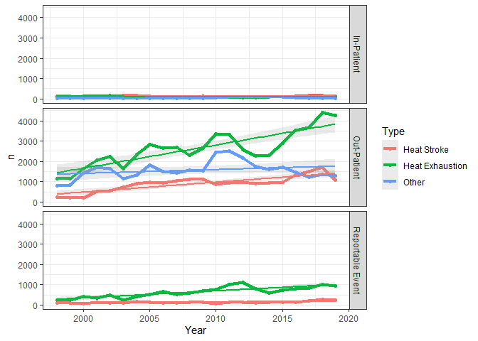
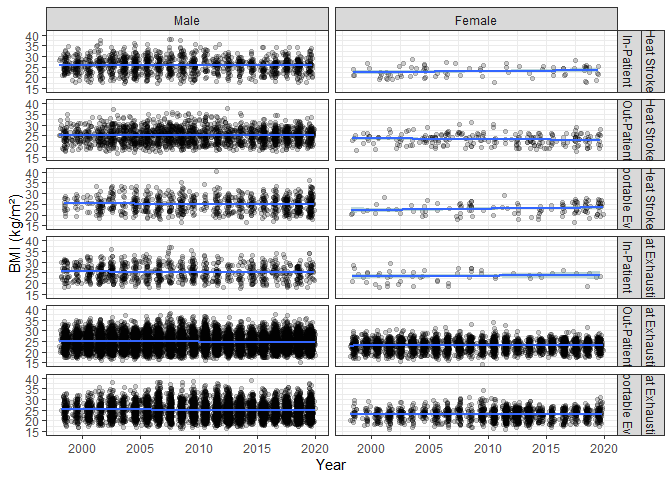

4\_report
================
SL
5/17/2021

``` r
df_hsi <- read_rds("data/df_hsi.rds")

Hmisc::describe(df_hsi)
```

    ## df_hsi 
    ## 
    ##  26  Variables      139405  Observations
    ## --------------------------------------------------------------------------------
    ## studyid 
    ##        n  missing distinct 
    ##   139405        0    66447 
    ## 
    ## lowest : S00000001 S00000002 S00000003 S00000004 S00000005
    ## highest: S00066443 S00066444 S00066445 S00066446 S00066447
    ## --------------------------------------------------------------------------------
    ## d_event 
    ##          n    missing   distinct       Info       Mean        Gmd        .05 
    ##     139405          0       8535          1 2010-02-18       2694 1999-05-11 
    ##        .10        .25        .50        .75        .90        .95 
    ## 2001-05-01 2005-06-15 2010-08-06 2015-08-18 2018-07-10 2019-06-13 
    ## 
    ## lowest : 1990-04-19 1990-08-19 1990-09-05 1990-09-26 1990-09-29
    ## highest: 2020-05-18 2020-05-19 2020-05-20 2020-05-21 2020-05-22
    ## --------------------------------------------------------------------------------
    ## dmisid 
    ##        n  missing distinct 
    ##   134067     5338      752 
    ## 
    ## lowest : 0000 0001 0002 0003 0004, highest: N265 N273 N279 N286 ZZZZ
    ## --------------------------------------------------------------------------------
    ## dx1 
    ##        n  missing distinct 
    ##   131147     8258     1349 
    ## 
    ## lowest : 00843  00869  0088   0090   0091  , highest: Z723   Z743   Z760   Z77098 Z87820
    ## --------------------------------------------------------------------------------
    ## dx2 
    ##        n  missing distinct 
    ##    68175    71230     2383 
    ## 
    ## lowest : 0049   0059   0088   0091   025   , highest: Z950   Z9852  Z98818 Z98890 Z9989 
    ## --------------------------------------------------------------------------------
    ## dx1_name 
    ##        n  missing distinct 
    ##    17609   121796        9 
    ## 
    ## lowest : HEAT DEHYDRATION              Heat Exhaustion               HEAT EXHAUSTION               HEAT ILLNESS                  HEAT ILLNESS, HEAT EXHAUSTION
    ## highest: HEAT ILLNESS, HEAT EXHAUSTION HEAT ILLNESS, HEAT INJURY     HEAT ILLNESS, HEAT STROKE     Heat Stroke                   HEAT STROKE                  
    ## 
    ## HEAT DEHYDRATION (7098, 0.403), Heat Exhaustion (2442, 0.139), HEAT EXHAUSTION
    ## (356, 0.020), HEAT ILLNESS (128, 0.007), HEAT ILLNESS, HEAT EXHAUSTION (3184,
    ## 0.181), HEAT ILLNESS, HEAT INJURY (1236, 0.070), HEAT ILLNESS, HEAT STROKE
    ## (2466, 0.140), Heat Stroke (654, 0.037), HEAT STROKE (45, 0.003)
    ## --------------------------------------------------------------------------------
    ## source 
    ##        n  missing distinct 
    ##   139405        0        3 
    ##                                            
    ## Value       INPATIENT OUTPATIENT        RME
    ## Frequency        7889     113907      17609
    ## Proportion      0.057      0.817      0.126
    ## --------------------------------------------------------------------------------
    ## age : Age Group 
    ##        n  missing distinct 
    ##   139375       30        6 
    ## 
    ## lowest : <20   20-24 25-29 30-34 35-39, highest: 20-24 25-29 30-34 35-39 >=40 
    ##                                               
    ## Value        <20 20-24 25-29 30-34 35-39  >=40
    ## Frequency  33001 58264 26144 12245  6165  3556
    ## Proportion 0.237 0.418 0.188 0.088 0.044 0.026
    ## --------------------------------------------------------------------------------
    ## sex : Sex 
    ##        n  missing distinct 
    ##   139405        0        3 
    ##                                
    ## Value           F      M      Z
    ## Frequency   22078 117318      9
    ## Proportion  0.158  0.842  0.000
    ## --------------------------------------------------------------------------------
    ## race_ethnic : Race/Ethnicity 
    ##        n  missing distinct 
    ##   139405        0        7 
    ## 
    ## lowest : American Indian/Alaskan Native Asian/Pacific Islander         Hispanic                       Non-Hispanic Black             Non-Hispanic White            
    ## highest: Hispanic                       Non-Hispanic Black             Non-Hispanic White             Other                          Unknown                       
    ## 
    ## American Indian/Alaskan Native (1114, 0.008), Asian/Pacific Islander (6624,
    ## 0.048), Hispanic (15230, 0.109), Non-Hispanic Black (26708, 0.192),
    ## Non-Hispanic White (84616, 0.607), Other (2706, 0.019), Unknown (2407, 0.017)
    ## --------------------------------------------------------------------------------
    ## service : Service Branch 
    ##        n  missing distinct 
    ##   139405        0        5 
    ## 
    ## lowest : A C F M N, highest: A C F M N
    ##                                         
    ## Value          A     C     F     M     N
    ## Frequency  86262   669 10199 34487  7788
    ## Proportion 0.619 0.005 0.073 0.247 0.056
    ## --------------------------------------------------------------------------------
    ## component 
    ##        n  missing distinct    value 
    ##   139405        0        1        A 
    ##                  
    ## Value           A
    ## Frequency  139405
    ## Proportion      1
    ## --------------------------------------------------------------------------------
    ## grade : Grade Group 
    ##        n  missing distinct 
    ##   139399        6        4 
    ##                                                               
    ## Value             E1-E4        E5-E9  O1-O3/W1-W3 O4-O10/W4-W5
    ## Frequency         99543        26217        12184         1455
    ## Proportion        0.714        0.188        0.087        0.010
    ## --------------------------------------------------------------------------------
    ## height 
    ##        n  missing distinct     Info     Mean      Gmd      .05      .10 
    ##   125223    14182       99    0.997    68.29    3.778     62.0     64.0 
    ##      .25      .50      .75      .90      .95 
    ##     66.0     68.5     70.5     72.5     73.5 
    ## 
    ## lowest : 52.00 53.00 56.00 56.50 56.75, highest: 79.50 79.75 80.00 88.00 99.50
    ## --------------------------------------------------------------------------------
    ## weight 
    ##        n  missing distinct     Info     Mean      Gmd      .05      .10 
    ##   125223    14182      217        1    166.6    34.87      119      128 
    ##      .25      .50      .75      .90      .95 
    ##      144      165      187      208      220 
    ## 
    ## lowest :  81  85  86  87  88, highest: 300 301 310 321 333
    ## --------------------------------------------------------------------------------
    ## bmi : BMI 
    ##        n  missing distinct     Info     Mean      Gmd      .05      .10 
    ##   125223    14182     6205        1       25    4.046    19.50    20.39 
    ##      .25      .50      .75      .90      .95 
    ##    22.31    24.87    27.39    29.70    31.01 
    ## 
    ## lowest : 11.99326 12.21861 12.37280 13.26645 14.34694
    ## highest: 39.05556 39.42427 39.59799 40.59278 41.39136
    ## --------------------------------------------------------------------------------
    ## hor_country 
    ##        n  missing distinct 
    ##   139404        1       54 
    ## 
    ## lowest : 68  76  79  87  AF , highest: US  USA VIR VQ  ZZZ
    ## --------------------------------------------------------------------------------
    ## hor_state 
    ##        n  missing distinct 
    ##   139404        1       62 
    ## 
    ## lowest : AK AL AR AS AZ, highest: WA WI WV WY ZZ
    ## --------------------------------------------------------------------------------
    ## bmi_int 
    ##        n  missing distinct     Info     Mean      Gmd      .05      .10 
    ##   125223    14182       16    0.973       25    4.049       20       20 
    ##      .25      .50      .75      .90      .95 
    ##       22       24       28       30       32 
    ## 
    ## lowest : 12 14 16 18 20, highest: 34 36 38 40 42
    ##                                                                             
    ## Value         12    14    16    18    20    22    24    26    28    30    32
    ## Frequency      4     7   130  3775 13778 21197 25454 24929 19049 10391  4212
    ## Proportion 0.000 0.000 0.001 0.030 0.110 0.169 0.203 0.199 0.152 0.083 0.034
    ##                                         
    ## Value         34    36    38    40    42
    ## Frequency   1624   520   137    13     3
    ## Proportion 0.013 0.004 0.001 0.000 0.000
    ## --------------------------------------------------------------------------------
    ## hsi : HSI Diagnosis 
    ##        n  missing distinct 
    ##   139405        0        3 
    ##                                                           
    ## Value      heat_exhaustion           other     heat_stroke
    ## Frequency            76920           36390           26095
    ## Proportion           0.552           0.261           0.187
    ## --------------------------------------------------------------------------------
    ## id 
    ##        n  missing distinct     Info     Mean      Gmd      .05      .10 
    ##   139405        0   139405        1    69703    46469     6971    13941 
    ##      .25      .50      .75      .90      .95 
    ##    34852    69703   104554   125465   132435 
    ## 
    ## lowest :      1      2      3      4      5, highest: 139401 139402 139403 139404 139405
    ## --------------------------------------------------------------------------------
    ## rhabdo : Rhabdomyolysis Co-morbidity 
    ##        n  missing distinct 
    ##   139405        0        2 
    ##                         
    ## Value           0      1
    ## Frequency  135597   3808
    ## Proportion  0.973  0.027
    ## --------------------------------------------------------------------------------
    ## casedef : Case-defined HSI (unique incidence) 
    ##        n  missing distinct 
    ##   139405        0        2 
    ##                       
    ## Value          0     1
    ## Frequency  69524 69881
    ## Proportion 0.499 0.501
    ## --------------------------------------------------------------------------------
    ## bmi_cat : BMI Categories 
    ##        n  missing distinct 
    ##   125223    14182        4 
    ##                                                           
    ## Value      underweight      normal  overweight       obese
    ## Frequency         2205       62140       50175       10703
    ## Proportion       0.018       0.496       0.401       0.085
    ## --------------------------------------------------------------------------------
    ## year 
    ##        n  missing distinct     Info     Mean      Gmd      .05      .10 
    ##   139405        0       31    0.998     2010    7.367     1999     2001 
    ##      .25      .50      .75      .90      .95 
    ##     2005     2010     2015     2018     2019 
    ## 
    ## lowest : 1990 1991 1992 1993 1994, highest: 2016 2017 2018 2019 2020
    ## --------------------------------------------------------------------------------
    ## decade : Decade of Incidence 
    ##        n  missing distinct 
    ##   139405        0        4 
    ##                                   
    ## Value       1990  2000  2010  2020
    ## Frequency   9404 55109 74259   633
    ## Proportion 0.067 0.395 0.533 0.005
    ## --------------------------------------------------------------------------------

``` r
hsi_factors <- read_rds("data/hsi_factors.rds")

#hsi_factors %>% count(var)
```

## Table 1

Recode for display Restrict to years: 1998 - 2019

``` r
df_hsi %>% count(service)
```

    ## # A tibble: 5 x 2
    ##   service     n
    ##   <fct>   <int>
    ## 1 A       86262
    ## 2 C         669
    ## 3 F       10199
    ## 4 M       34487
    ## 5 N        7788

``` r
df_hsi_table_other <-
  df_hsi %>%
    dplyr::filter(year > 1997 & year < 2020) %>% 
     dplyr::select(source, age, sex, race_ethnic, service, grade, hsi, bmi, casedef, bmi_cat, year) %>% 
       mutate(service = recode_factor(service,
            "A" = "Army",
            "N" = "Navy",
            "F" = "Air Force",
            "M" = "Marine Corps",
            "C" = "Coast Guard"
            ),
            source = recode_factor(source,
            "INPATIENT" = "In-Patient",
            "OUTPATIENT" = "Out-Patient",
            "RME" = "Reportable Event"),
            hsi = recode_factor(hsi,
            "heat_stroke" = "Heat Stroke",
            "heat_exhaustion" = "Heat Exhaustion",
            "other" = "Other"),
            sex = recode_factor(sex,
            "M" = "Male",
            "F" = "Female",
            "Z" = "Unknown")
            ) %>% 
            haven::zap_label()


df_hsi_table <-
  df_hsi_table_other %>%
    dplyr::filter(!hsi %in% "Other") 
```

## Table formatting

``` r
# formatting for comma separators, https://github.com/benjaminrich/table1/issues/34

render.continuous <- function(x, ...) {
    with(stats.default(x, ...), c("",
        "Mean (SD)"         = sprintf("%s (%s)",
          signif_pad(MEAN,   3, big.mark=","),
          signif_pad(SD,     3, big.mark=",")),
        "Median [Min, Max]" = sprintf("%s [%s, %s]",
          signif_pad(MEDIAN, 3, big.mark=","),
          signif_pad(MIN,    3, big.mark=","),
          signif_pad(MAX,    3, big.mark=","))))
}


render.categorical <- function(x, ...) {
    c("", sapply(stats.apply.rounding(stats.default(x)), function(y) with(y,
      sprintf("%s (%s%%)", prettyNum(FREQ, big.mark=","), PCT))))
}

render.strat <- function (label, n, ...) {
    sprintf("<span class='stratlabel'>%s<br><span class='stratn'>(N=%s)</span></span>", 
        label, prettyNum(n, big.mark=","))
}
```

## Outcome table including “other HSI”

``` r
# by casedef (keep "1" and "overall" columns)
table1::table1(~ hsi + source + sex + age + sex + race_ethnic + grade + service + bmi + bmi_cat  | casedef, data = df_hsi_table_other)
```

    ## [1] "<table class=\"Rtable1\">\n<thead>\n<tr>\n<th class='rowlabel firstrow lastrow'></th>\n<th class='firstrow lastrow'><span class='stratlabel'>0<br><span class='stratn'>(N=68514)</span></span></th>\n<th class='firstrow lastrow'><span class='stratlabel'>1<br><span class='stratn'>(N=66415)</span></span></th>\n<th class='firstrow lastrow'><span class='stratlabel'>Overall<br><span class='stratn'>(N=134929)</span></span></th>\n</tr>\n</thead>\n<tbody>\n<tr>\n<td class='rowlabel firstrow'><span class='varlabel'>hsi</span></td>\n<td class='firstrow'></td>\n<td class='firstrow'></td>\n<td class='firstrow'></td>\n</tr>\n<tr>\n<td class='rowlabel'>Heat Stroke</td>\n<td>16877 (24.6%)</td>\n<td>8409 (12.7%)</td>\n<td>25286 (18.7%)</td>\n</tr>\n<tr>\n<td class='rowlabel'>Heat Exhaustion</td>\n<td>35788 (52.2%)</td>\n<td>38572 (58.1%)</td>\n<td>74360 (55.1%)</td>\n</tr>\n<tr>\n<td class='rowlabel lastrow'>Other</td>\n<td class='lastrow'>15849 (23.1%)</td>\n<td class='lastrow'>19434 (29.3%)</td>\n<td class='lastrow'>35283 (26.1%)</td>\n</tr>\n<tr>\n<td class='rowlabel firstrow'><span class='varlabel'>source</span></td>\n<td class='firstrow'></td>\n<td class='firstrow'></td>\n<td class='firstrow'></td>\n</tr>\n<tr>\n<td class='rowlabel'>In-Patient</td>\n<td>1152 (1.7%)</td>\n<td>4742 (7.1%)</td>\n<td>5894 (4.4%)</td>\n</tr>\n<tr>\n<td class='rowlabel'>Out-Patient</td>\n<td>63885 (93.2%)</td>\n<td>48037 (72.3%)</td>\n<td>111922 (82.9%)</td>\n</tr>\n<tr>\n<td class='rowlabel lastrow'>Reportable Event</td>\n<td class='lastrow'>3477 (5.1%)</td>\n<td class='lastrow'>13636 (20.5%)</td>\n<td class='lastrow'>17113 (12.7%)</td>\n</tr>\n<tr>\n<td class='rowlabel firstrow'><span class='varlabel'>sex</span></td>\n<td class='firstrow'></td>\n<td class='firstrow'></td>\n<td class='firstrow'></td>\n</tr>\n<tr>\n<td class='rowlabel'>Male</td>\n<td>59709 (87.1%)</td>\n<td>53714 (80.9%)</td>\n<td>113423 (84.1%)</td>\n</tr>\n<tr>\n<td class='rowlabel'>Female</td>\n<td>8800 (12.8%)</td>\n<td>12698 (19.1%)</td>\n<td>21498 (15.9%)</td>\n</tr>\n<tr>\n<td class='rowlabel lastrow'>Unknown</td>\n<td class='lastrow'>5 (0.0%)</td>\n<td class='lastrow'>3 (0.0%)</td>\n<td class='lastrow'>8 (0.0%)</td>\n</tr>\n<tr>\n<td class='rowlabel firstrow'><span class='varlabel'>age</span></td>\n<td class='firstrow'></td>\n<td class='firstrow'></td>\n<td class='firstrow'></td>\n</tr>\n<tr>\n<td class='rowlabel'><20</td>\n<td>16282 (23.8%)</td>\n<td>15780 (23.8%)</td>\n<td>32062 (23.8%)</td>\n</tr>\n<tr>\n<td class='rowlabel'>20-24</td>\n<td>28581 (41.7%)</td>\n<td>27736 (41.8%)</td>\n<td>56317 (41.7%)</td>\n</tr>\n<tr>\n<td class='rowlabel'>25-29</td>\n<td>13297 (19.4%)</td>\n<td>11964 (18.0%)</td>\n<td>25261 (18.7%)</td>\n</tr>\n<tr>\n<td class='rowlabel'>30-34</td>\n<td>6151 (9.0%)</td>\n<td>5703 (8.6%)</td>\n<td>11854 (8.8%)</td>\n</tr>\n<tr>\n<td class='rowlabel'>35-39</td>\n<td>2735 (4.0%)</td>\n<td>3216 (4.8%)</td>\n<td>5951 (4.4%)</td>\n</tr>\n<tr>\n<td class='rowlabel'>>=40</td>\n<td>1454 (2.1%)</td>\n<td>2004 (3.0%)</td>\n<td>3458 (2.6%)</td>\n</tr>\n<tr>\n<td class='rowlabel lastrow'>Missing</td>\n<td class='lastrow'>14 (0.0%)</td>\n<td class='lastrow'>12 (0.0%)</td>\n<td class='lastrow'>26 (0.0%)</td>\n</tr>\n<tr>\n<td class='rowlabel firstrow'><span class='varlabel'>race_ethnic</span></td>\n<td class='firstrow'></td>\n<td class='firstrow'></td>\n<td class='firstrow'></td>\n</tr>\n<tr>\n<td class='rowlabel'>American Indian/Alaskan Native</td>\n<td>574 (0.8%)</td>\n<td>488 (0.7%)</td>\n<td>1062 (0.8%)</td>\n</tr>\n<tr>\n<td class='rowlabel'>Asian/Pacific Islander</td>\n<td>3705 (5.4%)</td>\n<td>2758 (4.2%)</td>\n<td>6463 (4.8%)</td>\n</tr>\n<tr>\n<td class='rowlabel'>Hispanic</td>\n<td>7614 (11.1%)</td>\n<td>7294 (11.0%)</td>\n<td>14908 (11.0%)</td>\n</tr>\n<tr>\n<td class='rowlabel'>Non-Hispanic Black</td>\n<td>12697 (18.5%)</td>\n<td>13063 (19.7%)</td>\n<td>25760 (19.1%)</td>\n</tr>\n<tr>\n<td class='rowlabel'>Non-Hispanic White</td>\n<td>41751 (60.9%)</td>\n<td>40097 (60.4%)</td>\n<td>81848 (60.7%)</td>\n</tr>\n<tr>\n<td class='rowlabel'>Other</td>\n<td>1138 (1.7%)</td>\n<td>1461 (2.2%)</td>\n<td>2599 (1.9%)</td>\n</tr>\n<tr>\n<td class='rowlabel lastrow'>Unknown</td>\n<td class='lastrow'>1035 (1.5%)</td>\n<td class='lastrow'>1254 (1.9%)</td>\n<td class='lastrow'>2289 (1.7%)</td>\n</tr>\n<tr>\n<td class='rowlabel firstrow'><span class='varlabel'>grade</span></td>\n<td class='firstrow'></td>\n<td class='firstrow'></td>\n<td class='firstrow'></td>\n</tr>\n<tr>\n<td class='rowlabel'>E1-E4</td>\n<td>48513 (70.8%)</td>\n<td>47907 (72.1%)</td>\n<td>96420 (71.5%)</td>\n</tr>\n<tr>\n<td class='rowlabel'>E5-E9</td>\n<td>12140 (17.7%)</td>\n<td>13192 (19.9%)</td>\n<td>25332 (18.8%)</td>\n</tr>\n<tr>\n<td class='rowlabel'>O1-O3/W1-W3</td>\n<td>7203 (10.5%)</td>\n<td>4576 (6.9%)</td>\n<td>11779 (8.7%)</td>\n</tr>\n<tr>\n<td class='rowlabel'>O4-O10/W4-W5</td>\n<td>657 (1.0%)</td>\n<td>735 (1.1%)</td>\n<td>1392 (1.0%)</td>\n</tr>\n<tr>\n<td class='rowlabel lastrow'>Missing</td>\n<td class='lastrow'>1 (0.0%)</td>\n<td class='lastrow'>5 (0.0%)</td>\n<td class='lastrow'>6 (0.0%)</td>\n</tr>\n<tr>\n<td class='rowlabel firstrow'><span class='varlabel'>service</span></td>\n<td class='firstrow'></td>\n<td class='firstrow'></td>\n<td class='firstrow'></td>\n</tr>\n<tr>\n<td class='rowlabel'>Army</td>\n<td>46182 (67.4%)</td>\n<td>37304 (56.2%)</td>\n<td>83486 (61.9%)</td>\n</tr>\n<tr>\n<td class='rowlabel'>Navy</td>\n<td>2567 (3.7%)</td>\n<td>5005 (7.5%)</td>\n<td>7572 (5.6%)</td>\n</tr>\n<tr>\n<td class='rowlabel'>Air Force</td>\n<td>2589 (3.8%)</td>\n<td>7279 (11.0%)</td>\n<td>9868 (7.3%)</td>\n</tr>\n<tr>\n<td class='rowlabel'>Marine Corps</td>\n<td>16998 (24.8%)</td>\n<td>16342 (24.6%)</td>\n<td>33340 (24.7%)</td>\n</tr>\n<tr>\n<td class='rowlabel lastrow'>Coast Guard</td>\n<td class='lastrow'>178 (0.3%)</td>\n<td class='lastrow'>485 (0.7%)</td>\n<td class='lastrow'>663 (0.5%)</td>\n</tr>\n<tr>\n<td class='rowlabel firstrow'><span class='varlabel'>bmi</span></td>\n<td class='firstrow'></td>\n<td class='firstrow'></td>\n<td class='firstrow'></td>\n</tr>\n<tr>\n<td class='rowlabel'>Mean (SD)</td>\n<td>25.2 (3.60)</td>\n<td>24.7 (3.53)</td>\n<td>25.0 (3.57)</td>\n</tr>\n<tr>\n<td class='rowlabel'>Median [Min, Max]</td>\n<td>25.1 [12.4, 41.4]</td>\n<td>24.6 [12.0, 41.4]</td>\n<td>24.9 [12.0, 41.4]</td>\n</tr>\n<tr>\n<td class='rowlabel lastrow'>Missing</td>\n<td class='lastrow'>6065 (8.9%)</td>\n<td class='lastrow'>6196 (9.3%)</td>\n<td class='lastrow'>12261 (9.1%)</td>\n</tr>\n<tr>\n<td class='rowlabel firstrow'><span class='varlabel'>bmi_cat</span></td>\n<td class='firstrow'></td>\n<td class='firstrow'></td>\n<td class='firstrow'></td>\n</tr>\n<tr>\n<td class='rowlabel'>underweight</td>\n<td>957 (1.4%)</td>\n<td>1204 (1.8%)</td>\n<td>2161 (1.6%)</td>\n</tr>\n<tr>\n<td class='rowlabel'>normal</td>\n<td>29396 (42.9%)</td>\n<td>31528 (47.5%)</td>\n<td>60924 (45.2%)</td>\n</tr>\n<tr>\n<td class='rowlabel'>overweight</td>\n<td>26119 (38.1%)</td>\n<td>23014 (34.7%)</td>\n<td>49133 (36.4%)</td>\n</tr>\n<tr>\n<td class='rowlabel'>obese</td>\n<td>5977 (8.7%)</td>\n<td>4473 (6.7%)</td>\n<td>10450 (7.7%)</td>\n</tr>\n<tr>\n<td class='rowlabel lastrow'>Missing</td>\n<td class='lastrow'>6065 (8.9%)</td>\n<td class='lastrow'>6196 (9.3%)</td>\n<td class='lastrow'>12261 (9.1%)</td>\n</tr>\n</tbody>\n</table>\n"

``` r
# by casedef (keep "1" and "overall" columns)
table1::table1(~ hsi + source + sex + age + sex + race_ethnic + grade + service + bmi + bmi_cat  | casedef, data = df_hsi_table_other, render.continuous = render.continuous, render.categorical = render.categorical, render.strat = render.strat)
```

    ## [1] "<table class=\"Rtable1\">\n<thead>\n<tr>\n<th class='rowlabel firstrow lastrow'></th>\n<th class='firstrow lastrow'><span class='stratlabel'>0<br><span class='stratn'>(N=68,514)</span></span></th>\n<th class='firstrow lastrow'><span class='stratlabel'>1<br><span class='stratn'>(N=66,415)</span></span></th>\n<th class='firstrow lastrow'><span class='stratlabel'>Overall<br><span class='stratn'>(N=134,929)</span></span></th>\n</tr>\n</thead>\n<tbody>\n<tr>\n<td class='rowlabel firstrow'><span class='varlabel'>hsi</span></td>\n<td class='firstrow'></td>\n<td class='firstrow'></td>\n<td class='firstrow'></td>\n</tr>\n<tr>\n<td class='rowlabel'>Heat Stroke</td>\n<td>16,877 (24.6%)</td>\n<td>8,409 (12.7%)</td>\n<td>25,286 (18.7%)</td>\n</tr>\n<tr>\n<td class='rowlabel'>Heat Exhaustion</td>\n<td>35,788 (52.2%)</td>\n<td>38,572 (58.1%)</td>\n<td>74,360 (55.1%)</td>\n</tr>\n<tr>\n<td class='rowlabel lastrow'>Other</td>\n<td class='lastrow'>15,849 (23.1%)</td>\n<td class='lastrow'>19,434 (29.3%)</td>\n<td class='lastrow'>35,283 (26.1%)</td>\n</tr>\n<tr>\n<td class='rowlabel firstrow'><span class='varlabel'>source</span></td>\n<td class='firstrow'></td>\n<td class='firstrow'></td>\n<td class='firstrow'></td>\n</tr>\n<tr>\n<td class='rowlabel'>In-Patient</td>\n<td>1,152 (1.7%)</td>\n<td>4,742 (7.1%)</td>\n<td>5,894 (4.4%)</td>\n</tr>\n<tr>\n<td class='rowlabel'>Out-Patient</td>\n<td>63,885 (93.2%)</td>\n<td>48,037 (72.3%)</td>\n<td>111,922 (82.9%)</td>\n</tr>\n<tr>\n<td class='rowlabel lastrow'>Reportable Event</td>\n<td class='lastrow'>3,477 (5.1%)</td>\n<td class='lastrow'>13,636 (20.5%)</td>\n<td class='lastrow'>17,113 (12.7%)</td>\n</tr>\n<tr>\n<td class='rowlabel firstrow'><span class='varlabel'>sex</span></td>\n<td class='firstrow'></td>\n<td class='firstrow'></td>\n<td class='firstrow'></td>\n</tr>\n<tr>\n<td class='rowlabel'>Male</td>\n<td>59,709 (87.1%)</td>\n<td>53,714 (80.9%)</td>\n<td>113,423 (84.1%)</td>\n</tr>\n<tr>\n<td class='rowlabel'>Female</td>\n<td>8,800 (12.8%)</td>\n<td>12,698 (19.1%)</td>\n<td>21,498 (15.9%)</td>\n</tr>\n<tr>\n<td class='rowlabel lastrow'>Unknown</td>\n<td class='lastrow'>5 (0.0%)</td>\n<td class='lastrow'>3 (0.0%)</td>\n<td class='lastrow'>8 (0.0%)</td>\n</tr>\n<tr>\n<td class='rowlabel firstrow'><span class='varlabel'>age</span></td>\n<td class='firstrow'></td>\n<td class='firstrow'></td>\n<td class='firstrow'></td>\n</tr>\n<tr>\n<td class='rowlabel'><20</td>\n<td>16,282 (23.8%)</td>\n<td>15,780 (23.8%)</td>\n<td>32,062 (23.8%)</td>\n</tr>\n<tr>\n<td class='rowlabel'>20-24</td>\n<td>28,581 (41.7%)</td>\n<td>27,736 (41.8%)</td>\n<td>56,317 (41.7%)</td>\n</tr>\n<tr>\n<td class='rowlabel'>25-29</td>\n<td>13,297 (19.4%)</td>\n<td>11,964 (18.0%)</td>\n<td>25,261 (18.7%)</td>\n</tr>\n<tr>\n<td class='rowlabel'>30-34</td>\n<td>6,151 (9.0%)</td>\n<td>5,703 (8.6%)</td>\n<td>11,854 (8.8%)</td>\n</tr>\n<tr>\n<td class='rowlabel'>35-39</td>\n<td>2,735 (4.0%)</td>\n<td>3,216 (4.8%)</td>\n<td>5,951 (4.4%)</td>\n</tr>\n<tr>\n<td class='rowlabel'>>=40</td>\n<td>1,454 (2.1%)</td>\n<td>2,004 (3.0%)</td>\n<td>3,458 (2.6%)</td>\n</tr>\n<tr>\n<td class='rowlabel lastrow'>Missing</td>\n<td class='lastrow'>14 (0.0%)</td>\n<td class='lastrow'>12 (0.0%)</td>\n<td class='lastrow'>26 (0.0%)</td>\n</tr>\n<tr>\n<td class='rowlabel firstrow'><span class='varlabel'>race_ethnic</span></td>\n<td class='firstrow'></td>\n<td class='firstrow'></td>\n<td class='firstrow'></td>\n</tr>\n<tr>\n<td class='rowlabel'>American Indian/Alaskan Native</td>\n<td>574 (0.8%)</td>\n<td>488 (0.7%)</td>\n<td>1,062 (0.8%)</td>\n</tr>\n<tr>\n<td class='rowlabel'>Asian/Pacific Islander</td>\n<td>3,705 (5.4%)</td>\n<td>2,758 (4.2%)</td>\n<td>6,463 (4.8%)</td>\n</tr>\n<tr>\n<td class='rowlabel'>Hispanic</td>\n<td>7,614 (11.1%)</td>\n<td>7,294 (11.0%)</td>\n<td>14,908 (11.0%)</td>\n</tr>\n<tr>\n<td class='rowlabel'>Non-Hispanic Black</td>\n<td>12,697 (18.5%)</td>\n<td>13,063 (19.7%)</td>\n<td>25,760 (19.1%)</td>\n</tr>\n<tr>\n<td class='rowlabel'>Non-Hispanic White</td>\n<td>41,751 (60.9%)</td>\n<td>40,097 (60.4%)</td>\n<td>81,848 (60.7%)</td>\n</tr>\n<tr>\n<td class='rowlabel'>Other</td>\n<td>1,138 (1.7%)</td>\n<td>1,461 (2.2%)</td>\n<td>2,599 (1.9%)</td>\n</tr>\n<tr>\n<td class='rowlabel lastrow'>Unknown</td>\n<td class='lastrow'>1,035 (1.5%)</td>\n<td class='lastrow'>1,254 (1.9%)</td>\n<td class='lastrow'>2,289 (1.7%)</td>\n</tr>\n<tr>\n<td class='rowlabel firstrow'><span class='varlabel'>grade</span></td>\n<td class='firstrow'></td>\n<td class='firstrow'></td>\n<td class='firstrow'></td>\n</tr>\n<tr>\n<td class='rowlabel'>E1-E4</td>\n<td>48,513 (70.8%)</td>\n<td>47,907 (72.1%)</td>\n<td>96,420 (71.5%)</td>\n</tr>\n<tr>\n<td class='rowlabel'>E5-E9</td>\n<td>12,140 (17.7%)</td>\n<td>13,192 (19.9%)</td>\n<td>25,332 (18.8%)</td>\n</tr>\n<tr>\n<td class='rowlabel'>O1-O3/W1-W3</td>\n<td>7,203 (10.5%)</td>\n<td>4,576 (6.9%)</td>\n<td>11,779 (8.7%)</td>\n</tr>\n<tr>\n<td class='rowlabel'>O4-O10/W4-W5</td>\n<td>657 (1.0%)</td>\n<td>735 (1.1%)</td>\n<td>1,392 (1.0%)</td>\n</tr>\n<tr>\n<td class='rowlabel lastrow'>Missing</td>\n<td class='lastrow'>1 (0.0%)</td>\n<td class='lastrow'>5 (0.0%)</td>\n<td class='lastrow'>6 (0.0%)</td>\n</tr>\n<tr>\n<td class='rowlabel firstrow'><span class='varlabel'>service</span></td>\n<td class='firstrow'></td>\n<td class='firstrow'></td>\n<td class='firstrow'></td>\n</tr>\n<tr>\n<td class='rowlabel'>Army</td>\n<td>46,182 (67.4%)</td>\n<td>37,304 (56.2%)</td>\n<td>83,486 (61.9%)</td>\n</tr>\n<tr>\n<td class='rowlabel'>Navy</td>\n<td>2,567 (3.7%)</td>\n<td>5,005 (7.5%)</td>\n<td>7,572 (5.6%)</td>\n</tr>\n<tr>\n<td class='rowlabel'>Air Force</td>\n<td>2,589 (3.8%)</td>\n<td>7,279 (11.0%)</td>\n<td>9,868 (7.3%)</td>\n</tr>\n<tr>\n<td class='rowlabel'>Marine Corps</td>\n<td>16,998 (24.8%)</td>\n<td>16,342 (24.6%)</td>\n<td>33,340 (24.7%)</td>\n</tr>\n<tr>\n<td class='rowlabel lastrow'>Coast Guard</td>\n<td class='lastrow'>178 (0.3%)</td>\n<td class='lastrow'>485 (0.7%)</td>\n<td class='lastrow'>663 (0.5%)</td>\n</tr>\n<tr>\n<td class='rowlabel firstrow'><span class='varlabel'>bmi</span></td>\n<td class='firstrow'></td>\n<td class='firstrow'></td>\n<td class='firstrow'></td>\n</tr>\n<tr>\n<td class='rowlabel'>Mean (SD)</td>\n<td>25.2 (3.60)</td>\n<td>24.7 (3.53)</td>\n<td>25.0 (3.57)</td>\n</tr>\n<tr>\n<td class='rowlabel'>Median [Min, Max]</td>\n<td>25.1 [12.4, 41.4]</td>\n<td>24.6 [12.0, 41.4]</td>\n<td>24.9 [12.0, 41.4]</td>\n</tr>\n<tr>\n<td class='rowlabel lastrow'>Missing</td>\n<td class='lastrow'>6065 (8.9%)</td>\n<td class='lastrow'>6196 (9.3%)</td>\n<td class='lastrow'>12261 (9.1%)</td>\n</tr>\n<tr>\n<td class='rowlabel firstrow'><span class='varlabel'>bmi_cat</span></td>\n<td class='firstrow'></td>\n<td class='firstrow'></td>\n<td class='firstrow'></td>\n</tr>\n<tr>\n<td class='rowlabel'>underweight</td>\n<td>957 (1.4%)</td>\n<td>1,204 (1.8%)</td>\n<td>2,161 (1.6%)</td>\n</tr>\n<tr>\n<td class='rowlabel'>normal</td>\n<td>29,396 (42.9%)</td>\n<td>31,528 (47.5%)</td>\n<td>60,924 (45.2%)</td>\n</tr>\n<tr>\n<td class='rowlabel'>overweight</td>\n<td>26,119 (38.1%)</td>\n<td>23,014 (34.7%)</td>\n<td>49,133 (36.4%)</td>\n</tr>\n<tr>\n<td class='rowlabel'>obese</td>\n<td>5,977 (8.7%)</td>\n<td>4,473 (6.7%)</td>\n<td>10,450 (7.7%)</td>\n</tr>\n<tr>\n<td class='rowlabel lastrow'>Missing</td>\n<td class='lastrow'>6065 (8.9%)</td>\n<td class='lastrow'>6196 (9.3%)</td>\n<td class='lastrow'>12261 (9.1%)</td>\n</tr>\n</tbody>\n</table>\n"

## Restrict to heat stroke and heat exhaustion

``` r
table_1 <-
 table1::table1(~ hsi + source + sex + age + sex + race_ethnic + grade + service + bmi + bmi_cat  | casedef, data = df_hsi_table, , render.continuous = render.continuous, render.categorical = render.categorical, render.strat = render.strat)    

table_1
```

    ## [1] "<table class=\"Rtable1\">\n<thead>\n<tr>\n<th class='rowlabel firstrow lastrow'></th>\n<th class='firstrow lastrow'><span class='stratlabel'>0<br><span class='stratn'>(N=52,665)</span></span></th>\n<th class='firstrow lastrow'><span class='stratlabel'>1<br><span class='stratn'>(N=46,981)</span></span></th>\n<th class='firstrow lastrow'><span class='stratlabel'>Overall<br><span class='stratn'>(N=99,646)</span></span></th>\n</tr>\n</thead>\n<tbody>\n<tr>\n<td class='rowlabel firstrow'><span class='varlabel'>hsi</span></td>\n<td class='firstrow'></td>\n<td class='firstrow'></td>\n<td class='firstrow'></td>\n</tr>\n<tr>\n<td class='rowlabel'>Heat Stroke</td>\n<td>16,877 (32.0%)</td>\n<td>8,409 (17.9%)</td>\n<td>25,286 (25.4%)</td>\n</tr>\n<tr>\n<td class='rowlabel'>Heat Exhaustion</td>\n<td>35,788 (68.0%)</td>\n<td>38,572 (82.1%)</td>\n<td>74,360 (74.6%)</td>\n</tr>\n<tr>\n<td class='rowlabel lastrow'>Other</td>\n<td class='lastrow'>0 (0%)</td>\n<td class='lastrow'>0 (0%)</td>\n<td class='lastrow'>0 (0%)</td>\n</tr>\n<tr>\n<td class='rowlabel firstrow'><span class='varlabel'>source</span></td>\n<td class='firstrow'></td>\n<td class='firstrow'></td>\n<td class='firstrow'></td>\n</tr>\n<tr>\n<td class='rowlabel'>In-Patient</td>\n<td>747 (1.4%)</td>\n<td>4,131 (8.8%)</td>\n<td>4,878 (4.9%)</td>\n</tr>\n<tr>\n<td class='rowlabel'>Out-Patient</td>\n<td>48,441 (92.0%)</td>\n<td>29,214 (62.2%)</td>\n<td>77,655 (77.9%)</td>\n</tr>\n<tr>\n<td class='rowlabel lastrow'>Reportable Event</td>\n<td class='lastrow'>3,477 (6.6%)</td>\n<td class='lastrow'>13,636 (29.0%)</td>\n<td class='lastrow'>17,113 (17.2%)</td>\n</tr>\n<tr>\n<td class='rowlabel firstrow'><span class='varlabel'>sex</span></td>\n<td class='firstrow'></td>\n<td class='firstrow'></td>\n<td class='firstrow'></td>\n</tr>\n<tr>\n<td class='rowlabel'>Male</td>\n<td>46,854 (89.0%)</td>\n<td>39,093 (83.2%)</td>\n<td>85,947 (86.3%)</td>\n</tr>\n<tr>\n<td class='rowlabel'>Female</td>\n<td>5,807 (11.0%)</td>\n<td>7,885 (16.8%)</td>\n<td>13,692 (13.7%)</td>\n</tr>\n<tr>\n<td class='rowlabel lastrow'>Unknown</td>\n<td class='lastrow'>4 (0.0%)</td>\n<td class='lastrow'>3 (0.0%)</td>\n<td class='lastrow'>7 (0.0%)</td>\n</tr>\n<tr>\n<td class='rowlabel firstrow'><span class='varlabel'>age</span></td>\n<td class='firstrow'></td>\n<td class='firstrow'></td>\n<td class='firstrow'></td>\n</tr>\n<tr>\n<td class='rowlabel'><20</td>\n<td>11,192 (21.3%)</td>\n<td>10,384 (22.1%)</td>\n<td>21,576 (21.7%)</td>\n</tr>\n<tr>\n<td class='rowlabel'>20-24</td>\n<td>22,523 (42.8%)</td>\n<td>20,201 (43.0%)</td>\n<td>42,724 (42.9%)</td>\n</tr>\n<tr>\n<td class='rowlabel'>25-29</td>\n<td>10,591 (20.1%)</td>\n<td>8,684 (18.5%)</td>\n<td>19,275 (19.3%)</td>\n</tr>\n<tr>\n<td class='rowlabel'>30-34</td>\n<td>4,933 (9.4%)</td>\n<td>4,104 (8.7%)</td>\n<td>9,037 (9.1%)</td>\n</tr>\n<tr>\n<td class='rowlabel'>35-39</td>\n<td>2,239 (4.3%)</td>\n<td>2,250 (4.8%)</td>\n<td>4,489 (4.5%)</td>\n</tr>\n<tr>\n<td class='rowlabel'>>=40</td>\n<td>1,175 (2.2%)</td>\n<td>1,347 (2.9%)</td>\n<td>2,522 (2.5%)</td>\n</tr>\n<tr>\n<td class='rowlabel lastrow'>Missing</td>\n<td class='lastrow'>12 (0.0%)</td>\n<td class='lastrow'>11 (0.0%)</td>\n<td class='lastrow'>23 (0.0%)</td>\n</tr>\n<tr>\n<td class='rowlabel firstrow'><span class='varlabel'>race_ethnic</span></td>\n<td class='firstrow'></td>\n<td class='firstrow'></td>\n<td class='firstrow'></td>\n</tr>\n<tr>\n<td class='rowlabel'>American Indian/Alaskan Native</td>\n<td>458 (0.9%)</td>\n<td>382 (0.8%)</td>\n<td>840 (0.8%)</td>\n</tr>\n<tr>\n<td class='rowlabel'>Asian/Pacific Islander</td>\n<td>2,973 (5.6%)</td>\n<td>2,060 (4.4%)</td>\n<td>5,033 (5.1%)</td>\n</tr>\n<tr>\n<td class='rowlabel'>Hispanic</td>\n<td>5,907 (11.2%)</td>\n<td>5,305 (11.3%)</td>\n<td>11,212 (11.3%)</td>\n</tr>\n<tr>\n<td class='rowlabel'>Non-Hispanic Black</td>\n<td>9,104 (17.3%)</td>\n<td>8,568 (18.2%)</td>\n<td>17,672 (17.7%)</td>\n</tr>\n<tr>\n<td class='rowlabel'>Non-Hispanic White</td>\n<td>32,546 (61.8%)</td>\n<td>28,733 (61.2%)</td>\n<td>61,279 (61.5%)</td>\n</tr>\n<tr>\n<td class='rowlabel'>Other</td>\n<td>905 (1.7%)</td>\n<td>1,062 (2.3%)</td>\n<td>1,967 (2.0%)</td>\n</tr>\n<tr>\n<td class='rowlabel lastrow'>Unknown</td>\n<td class='lastrow'>772 (1.5%)</td>\n<td class='lastrow'>871 (1.9%)</td>\n<td class='lastrow'>1,643 (1.6%)</td>\n</tr>\n<tr>\n<td class='rowlabel firstrow'><span class='varlabel'>grade</span></td>\n<td class='firstrow'></td>\n<td class='firstrow'></td>\n<td class='firstrow'></td>\n</tr>\n<tr>\n<td class='rowlabel'>E1-E4</td>\n<td>36,265 (68.9%)</td>\n<td>33,562 (71.4%)</td>\n<td>69,827 (70.1%)</td>\n</tr>\n<tr>\n<td class='rowlabel'>E5-E9</td>\n<td>9,994 (19.0%)</td>\n<td>9,495 (20.2%)</td>\n<td>19,489 (19.6%)</td>\n</tr>\n<tr>\n<td class='rowlabel'>O1-O3/W1-W3</td>\n<td>5,830 (11.1%)</td>\n<td>3,377 (7.2%)</td>\n<td>9,207 (9.2%)</td>\n</tr>\n<tr>\n<td class='rowlabel'>O4-O10/W4-W5</td>\n<td>576 (1.1%)</td>\n<td>542 (1.2%)</td>\n<td>1,118 (1.1%)</td>\n</tr>\n<tr>\n<td class='rowlabel lastrow'>Missing</td>\n<td class='lastrow'>0 (0%)</td>\n<td class='lastrow'>5 (0.0%)</td>\n<td class='lastrow'>5 (0.0%)</td>\n</tr>\n<tr>\n<td class='rowlabel firstrow'><span class='varlabel'>service</span></td>\n<td class='firstrow'></td>\n<td class='firstrow'></td>\n<td class='firstrow'></td>\n</tr>\n<tr>\n<td class='rowlabel'>Army</td>\n<td>34,963 (66.4%)</td>\n<td>25,948 (55.2%)</td>\n<td>60,911 (61.1%)</td>\n</tr>\n<tr>\n<td class='rowlabel'>Navy</td>\n<td>2,033 (3.9%)</td>\n<td>3,459 (7.4%)</td>\n<td>5,492 (5.5%)</td>\n</tr>\n<tr>\n<td class='rowlabel'>Air Force</td>\n<td>2,052 (3.9%)</td>\n<td>4,987 (10.6%)</td>\n<td>7,039 (7.1%)</td>\n</tr>\n<tr>\n<td class='rowlabel'>Marine Corps</td>\n<td>13,474 (25.6%)</td>\n<td>12,258 (26.1%)</td>\n<td>25,732 (25.8%)</td>\n</tr>\n<tr>\n<td class='rowlabel lastrow'>Coast Guard</td>\n<td class='lastrow'>143 (0.3%)</td>\n<td class='lastrow'>329 (0.7%)</td>\n<td class='lastrow'>472 (0.5%)</td>\n</tr>\n<tr>\n<td class='rowlabel firstrow'><span class='varlabel'>bmi</span></td>\n<td class='firstrow'></td>\n<td class='firstrow'></td>\n<td class='firstrow'></td>\n</tr>\n<tr>\n<td class='rowlabel'>Mean (SD)</td>\n<td>25.3 (3.59)</td>\n<td>24.8 (3.51)</td>\n<td>25.1 (3.56)</td>\n</tr>\n<tr>\n<td class='rowlabel'>Median [Min, Max]</td>\n<td>25.2 [15.2, 39.6]</td>\n<td>24.7 [12.2, 40.6]</td>\n<td>25.0 [12.2, 40.6]</td>\n</tr>\n<tr>\n<td class='rowlabel lastrow'>Missing</td>\n<td class='lastrow'>4940 (9.4%)</td>\n<td class='lastrow'>4334 (9.2%)</td>\n<td class='lastrow'>9274 (9.3%)</td>\n</tr>\n<tr>\n<td class='rowlabel firstrow'><span class='varlabel'>bmi_cat</span></td>\n<td class='firstrow'></td>\n<td class='firstrow'></td>\n<td class='firstrow'></td>\n</tr>\n<tr>\n<td class='rowlabel'>underweight</td>\n<td>680 (1.3%)</td>\n<td>802 (1.7%)</td>\n<td>1,482 (1.5%)</td>\n</tr>\n<tr>\n<td class='rowlabel'>normal</td>\n<td>22,112 (42.0%)</td>\n<td>22,050 (46.9%)</td>\n<td>44,162 (44.3%)</td>\n</tr>\n<tr>\n<td class='rowlabel'>overweight</td>\n<td>20,278 (38.5%)</td>\n<td>16,628 (35.4%)</td>\n<td>36,906 (37.0%)</td>\n</tr>\n<tr>\n<td class='rowlabel'>obese</td>\n<td>4,655 (8.8%)</td>\n<td>3,167 (6.7%)</td>\n<td>7,822 (7.8%)</td>\n</tr>\n<tr>\n<td class='rowlabel lastrow'>Missing</td>\n<td class='lastrow'>4940 (9.4%)</td>\n<td class='lastrow'>4334 (9.2%)</td>\n<td class='lastrow'>9274 (9.3%)</td>\n</tr>\n</tbody>\n</table>\n"

## Cross-Tabulation

``` r
# Among Casedef

df_hsi_table %>%
  dplyr::filter(casedef == 1) %>% 
  dplyr::count(age, grade, sex, race_ethnic)
```

    ## # A tibble: 254 x 5
    ##    age   grade sex    race_ethnic                        n
    ##    <fct> <fct> <fct>  <fct>                          <int>
    ##  1 <20   E1-E4 Male   American Indian/Alaskan Native    71
    ##  2 <20   E1-E4 Male   Asian/Pacific Islander           342
    ##  3 <20   E1-E4 Male   Hispanic                        1041
    ##  4 <20   E1-E4 Male   Non-Hispanic Black              1134
    ##  5 <20   E1-E4 Male   Non-Hispanic White              5517
    ##  6 <20   E1-E4 Male   Other                            170
    ##  7 <20   E1-E4 Male   Unknown                          107
    ##  8 <20   E1-E4 Female American Indian/Alaskan Native    19
    ##  9 <20   E1-E4 Female Asian/Pacific Islander            97
    ## 10 <20   E1-E4 Female Hispanic                         290
    ## # ... with 244 more rows

``` r
# age and grade

df_hsi_table %>%
  dplyr::filter(casedef == 1) %>% 
  dplyr::count(age, grade)
```

    ## # A tibble: 26 x 3
    ##    age   grade           n
    ##    <fct> <fct>       <int>
    ##  1 <20   E1-E4       10374
    ##  2 <20   E5-E9           9
    ##  3 <20   O1-O3/W1-W3     1
    ##  4 20-24 E1-E4       17431
    ##  5 20-24 E5-E9        1466
    ##  6 20-24 O1-O3/W1-W3  1304
    ##  7 25-29 E1-E4        4347
    ##  8 25-29 E5-E9        3168
    ##  9 25-29 O1-O3/W1-W3  1168
    ## 10 25-29 <NA>            1
    ## # ... with 16 more rows

``` r
df_hsi_casedef <- 
  df_hsi_table %>%
  dplyr::filter(casedef == 1)

age_grade_crosstab <-
  gmodels::CrossTable(df_hsi_casedef$age, df_hsi_casedef$grade, prop.chisq = FALSE, chisq = TRUE)
```

    ## 
    ##  
    ##    Cell Contents
    ## |-------------------------|
    ## |                       N |
    ## |           N / Row Total |
    ## |           N / Col Total |
    ## |         N / Table Total |
    ## |-------------------------|
    ## 
    ##  
    ## Total Observations in Table:  46965 
    ## 
    ##  
    ##                    | df_hsi_casedef$grade 
    ## df_hsi_casedef$age |        E1-E4 |        E5-E9 |  O1-O3/W1-W3 | O4-O10/W4-W5 |    Row Total | 
    ## -------------------|--------------|--------------|--------------|--------------|--------------|
    ##                <20 |        10374 |            9 |            1 |            0 |        10384 | 
    ##                    |        0.999 |        0.001 |        0.000 |        0.000 |        0.221 | 
    ##                    |        0.309 |        0.001 |        0.000 |        0.000 |              | 
    ##                    |        0.221 |        0.000 |        0.000 |        0.000 |              | 
    ## -------------------|--------------|--------------|--------------|--------------|--------------|
    ##              20-24 |        17431 |         1466 |         1304 |            0 |        20201 | 
    ##                    |        0.863 |        0.073 |        0.065 |        0.000 |        0.430 | 
    ##                    |        0.519 |        0.155 |        0.386 |        0.000 |              | 
    ##                    |        0.371 |        0.031 |        0.028 |        0.000 |              | 
    ## -------------------|--------------|--------------|--------------|--------------|--------------|
    ##              25-29 |         4347 |         3168 |         1168 |            0 |         8683 | 
    ##                    |        0.501 |        0.365 |        0.135 |        0.000 |        0.185 | 
    ##                    |        0.130 |        0.334 |        0.346 |        0.000 |              | 
    ##                    |        0.093 |        0.067 |        0.025 |        0.000 |              | 
    ## -------------------|--------------|--------------|--------------|--------------|--------------|
    ##              30-34 |         1053 |         2424 |          558 |           68 |         4103 | 
    ##                    |        0.257 |        0.591 |        0.136 |        0.017 |        0.087 | 
    ##                    |        0.031 |        0.256 |        0.165 |        0.125 |              | 
    ##                    |        0.022 |        0.052 |        0.012 |        0.001 |              | 
    ## -------------------|--------------|--------------|--------------|--------------|--------------|
    ##              35-39 |          282 |         1566 |          233 |          167 |         2248 | 
    ##                    |        0.125 |        0.697 |        0.104 |        0.074 |        0.048 | 
    ##                    |        0.008 |        0.165 |        0.069 |        0.308 |              | 
    ##                    |        0.006 |        0.033 |        0.005 |        0.004 |              | 
    ## -------------------|--------------|--------------|--------------|--------------|--------------|
    ##               >=40 |           75 |          851 |          113 |          307 |         1346 | 
    ##                    |        0.056 |        0.632 |        0.084 |        0.228 |        0.029 | 
    ##                    |        0.002 |        0.090 |        0.033 |        0.566 |              | 
    ##                    |        0.002 |        0.018 |        0.002 |        0.007 |              | 
    ## -------------------|--------------|--------------|--------------|--------------|--------------|
    ##       Column Total |        33562 |         9484 |         3377 |          542 |        46965 | 
    ##                    |        0.715 |        0.202 |        0.072 |        0.012 |              | 
    ## -------------------|--------------|--------------|--------------|--------------|--------------|
    ## 
    ##  
    ## Statistics for All Table Factors
    ## 
    ## 
    ## Pearson's Chi-squared test 
    ## ------------------------------------------------------------
    ## Chi^2 =  25591.99     d.f. =  15     p =  0 
    ## 
    ## 
    ## 

``` r
gmodels::CrossTable(df_hsi_casedef$age, df_hsi_casedef$grade, 
                    prop.r = FALSE, prop.c = FALSE, prop.t = FALSE, prop.chisq = FALSE)
```

    ## 
    ##  
    ##    Cell Contents
    ## |-------------------------|
    ## |                       N |
    ## |-------------------------|
    ## 
    ##  
    ## Total Observations in Table:  46965 
    ## 
    ##  
    ##                    | df_hsi_casedef$grade 
    ## df_hsi_casedef$age |        E1-E4 |        E5-E9 |  O1-O3/W1-W3 | O4-O10/W4-W5 |    Row Total | 
    ## -------------------|--------------|--------------|--------------|--------------|--------------|
    ##                <20 |        10374 |            9 |            1 |            0 |        10384 | 
    ## -------------------|--------------|--------------|--------------|--------------|--------------|
    ##              20-24 |        17431 |         1466 |         1304 |            0 |        20201 | 
    ## -------------------|--------------|--------------|--------------|--------------|--------------|
    ##              25-29 |         4347 |         3168 |         1168 |            0 |         8683 | 
    ## -------------------|--------------|--------------|--------------|--------------|--------------|
    ##              30-34 |         1053 |         2424 |          558 |           68 |         4103 | 
    ## -------------------|--------------|--------------|--------------|--------------|--------------|
    ##              35-39 |          282 |         1566 |          233 |          167 |         2248 | 
    ## -------------------|--------------|--------------|--------------|--------------|--------------|
    ##               >=40 |           75 |          851 |          113 |          307 |         1346 | 
    ## -------------------|--------------|--------------|--------------|--------------|--------------|
    ##       Column Total |        33562 |         9484 |         3377 |          542 |        46965 | 
    ## -------------------|--------------|--------------|--------------|--------------|--------------|
    ## 
    ## 

``` r
age_grade_crosstab 
```

    ## $t
    ##        y
    ## x       E1-E4 E5-E9 O1-O3/W1-W3 O4-O10/W4-W5
    ##   <20   10374     9           1            0
    ##   20-24 17431  1466        1304            0
    ##   25-29  4347  3168        1168            0
    ##   30-34  1053  2424         558           68
    ##   35-39   282  1566         233          167
    ##   >=40     75   851         113          307
    ## 
    ## $prop.row
    ##        y
    ## x             E1-E4       E5-E9 O1-O3/W1-W3 O4-O10/W4-W5
    ##   <20   0.999036980 0.000866718 0.000096302  0.000000000
    ##   20-24 0.862878075 0.072570665 0.064551260  0.000000000
    ##   25-29 0.500633422 0.364850858 0.134515720  0.000000000
    ##   30-34 0.256641482 0.590787229 0.135998050  0.016573239
    ##   35-39 0.125444840 0.696619217 0.103647687  0.074288256
    ##   >=40  0.055720654 0.632243685 0.083952452  0.228083210
    ## 
    ## $prop.col
    ##        y
    ## x              E1-E4        E5-E9  O1-O3/W1-W3 O4-O10/W4-W5
    ##   <20   0.3090995769 0.0009489667 0.0002961208 0.0000000000
    ##   20-24 0.5193671414 0.1545761282 0.3861415458 0.0000000000
    ##   25-29 0.1295214826 0.3340362716 0.3458691146 0.0000000000
    ##   30-34 0.0313747691 0.2555883593 0.1652354160 0.1254612546
    ##   35-39 0.0084023598 0.1651202024 0.0689961504 0.3081180812
    ##   >=40  0.0022346702 0.0897300717 0.0334616524 0.5664206642
    ## 
    ## $prop.tbl
    ##        y
    ## x              E1-E4        E5-E9  O1-O3/W1-W3 O4-O10/W4-W5
    ##   <20   2.208879e-01 1.916321e-04 2.129245e-05 0.000000e+00
    ##   20-24 3.711487e-01 3.121473e-02 2.776536e-02 0.000000e+00
    ##   25-29 9.255829e-02 6.745449e-02 2.486958e-02 0.000000e+00
    ##   30-34 2.242095e-02 5.161290e-02 1.188119e-02 1.447887e-03
    ##   35-39 6.004471e-03 3.334398e-02 4.961141e-03 3.555839e-03
    ##   >=40  1.596934e-03 1.811988e-02 2.406047e-03 6.536783e-03
    ## 
    ## $chisq
    ## 
    ##  Pearson's Chi-squared test
    ## 
    ## data:  t
    ## X-squared = 25592, df = 15, p-value < 2.2e-16

``` r
# write_rds(age_grade_crosstab, file = "output/age_grade_crosstab.rds")


# race and service

df_hsi_table %>%
  dplyr::filter(casedef == 1) %>% 
  dplyr::count(service, race_ethnic)
```

    ## # A tibble: 33 x 3
    ##    service race_ethnic                        n
    ##    <fct>   <fct>                          <int>
    ##  1 Army    American Indian/Alaskan Native   185
    ##  2 Army    Asian/Pacific Islander          1181
    ##  3 Army    Hispanic                        2694
    ##  4 Army    Non-Hispanic Black              5548
    ##  5 Army    Non-Hispanic White             15714
    ##  6 Army    Other                            225
    ##  7 Army    Unknown                          401
    ##  8 Navy    American Indian/Alaskan Native    70
    ##  9 Navy    Asian/Pacific Islander           175
    ## 10 Navy    Hispanic                         430
    ## # ... with 23 more rows

``` r
gmodels::CrossTable(df_hsi_casedef$service, df_hsi_casedef$race_ethnic)
```

    ## 
    ##  
    ##    Cell Contents
    ## |-------------------------|
    ## |                       N |
    ## | Chi-square contribution |
    ## |           N / Row Total |
    ## |           N / Col Total |
    ## |         N / Table Total |
    ## |-------------------------|
    ## 
    ##  
    ## Total Observations in Table:  46981 
    ## 
    ##  
    ##                        | df_hsi_casedef$race_ethnic 
    ## df_hsi_casedef$service | American Indian/Alaskan Native |         Asian/Pacific Islander |                       Hispanic |             Non-Hispanic Black |             Non-Hispanic White |                          Other |                        Unknown |                      Row Total | 
    ## -----------------------|--------------------------------|--------------------------------|--------------------------------|--------------------------------|--------------------------------|--------------------------------|--------------------------------|--------------------------------|
    ##                   Army |                            185 |                           1181 |                           2694 |                           5548 |                          15714 |                            225 |                            401 |                          25948 | 
    ##                        |                          3.200 |                          1.644 |                         19.008 |                        140.647 |                          1.523 |                        222.861 |                         13.324 |                                | 
    ##                        |                          0.007 |                          0.046 |                          0.104 |                          0.214 |                          0.606 |                          0.009 |                          0.015 |                          0.552 | 
    ##                        |                          0.484 |                          0.573 |                          0.508 |                          0.648 |                          0.547 |                          0.212 |                          0.460 |                                | 
    ##                        |                          0.004 |                          0.025 |                          0.057 |                          0.118 |                          0.334 |                          0.005 |                          0.009 |                                | 
    ## -----------------------|--------------------------------|--------------------------------|--------------------------------|--------------------------------|--------------------------------|--------------------------------|--------------------------------|--------------------------------|
    ##                   Navy |                             70 |                            175 |                            430 |                            601 |                           1863 |                            268 |                             52 |                           3459 | 
    ##                        |                         62.348 |                          3.589 |                          3.978 |                          1.410 |                         30.134 |                        460.770 |                          2.294 |                                | 
    ##                        |                          0.020 |                          0.051 |                          0.124 |                          0.174 |                          0.539 |                          0.077 |                          0.015 |                          0.074 | 
    ##                        |                          0.183 |                          0.085 |                          0.081 |                          0.070 |                          0.065 |                          0.252 |                          0.060 |                                | 
    ##                        |                          0.001 |                          0.004 |                          0.009 |                          0.013 |                          0.040 |                          0.006 |                          0.001 |                                | 
    ## -----------------------|--------------------------------|--------------------------------|--------------------------------|--------------------------------|--------------------------------|--------------------------------|--------------------------------|--------------------------------|
    ##              Air Force |                             12 |                             76 |                            421 |                            808 |                           3286 |                            261 |                            123 |                           4987 | 
    ##                        |                         20.100 |                         93.082 |                         35.869 |                         11.325 |                         18.263 |                        195.012 |                         10.091 |                                | 
    ##                        |                          0.002 |                          0.015 |                          0.084 |                          0.162 |                          0.659 |                          0.052 |                          0.025 |                          0.106 | 
    ##                        |                          0.031 |                          0.037 |                          0.079 |                          0.094 |                          0.114 |                          0.246 |                          0.141 |                                | 
    ##                        |                          0.000 |                          0.002 |                          0.009 |                          0.017 |                          0.070 |                          0.006 |                          0.003 |                                | 
    ## -----------------------|--------------------------------|--------------------------------|--------------------------------|--------------------------------|--------------------------------|--------------------------------|--------------------------------|--------------------------------|
    ##           Marine Corps |                            115 |                            628 |                           1733 |                           1597 |                           7629 |                            281 |                            275 |                          12258 | 
    ##                        |                          2.358 |                         15.244 |                         87.922 |                        182.373 |                          2.330 |                          0.055 |                         10.030 |                                | 
    ##                        |                          0.009 |                          0.051 |                          0.141 |                          0.130 |                          0.622 |                          0.023 |                          0.022 |                          0.261 | 
    ##                        |                          0.301 |                          0.305 |                          0.327 |                          0.186 |                          0.266 |                          0.265 |                          0.316 |                                | 
    ##                        |                          0.002 |                          0.013 |                          0.037 |                          0.034 |                          0.162 |                          0.006 |                          0.006 |                                | 
    ## -----------------------|--------------------------------|--------------------------------|--------------------------------|--------------------------------|--------------------------------|--------------------------------|--------------------------------|--------------------------------|
    ##            Coast Guard |                              0 |                              0 |                             27 |                             14 |                            241 |                             27 |                             20 |                            329 | 
    ##                        |                          2.675 |                         14.426 |                          2.773 |                         35.267 |                          7.868 |                         51.460 |                         31.679 |                                | 
    ##                        |                          0.000 |                          0.000 |                          0.082 |                          0.043 |                          0.733 |                          0.082 |                          0.061 |                          0.007 | 
    ##                        |                          0.000 |                          0.000 |                          0.005 |                          0.002 |                          0.008 |                          0.025 |                          0.023 |                                | 
    ##                        |                          0.000 |                          0.000 |                          0.001 |                          0.000 |                          0.005 |                          0.001 |                          0.000 |                                | 
    ## -----------------------|--------------------------------|--------------------------------|--------------------------------|--------------------------------|--------------------------------|--------------------------------|--------------------------------|--------------------------------|
    ##           Column Total |                            382 |                           2060 |                           5305 |                           8568 |                          28733 |                           1062 |                            871 |                          46981 | 
    ##                        |                          0.008 |                          0.044 |                          0.113 |                          0.182 |                          0.612 |                          0.023 |                          0.019 |                                | 
    ## -----------------------|--------------------------------|--------------------------------|--------------------------------|--------------------------------|--------------------------------|--------------------------------|--------------------------------|--------------------------------|
    ## 
    ## 

``` r
race_service_crosstab <-
  gmodels::CrossTable(df_hsi_casedef$service, df_hsi_casedef$race_ethnic, prop.chisq = FALSE, chisq = TRUE)
```

    ## Warning in chisq.test(t, correct = FALSE, ...): Chi-squared approximation may be
    ## incorrect

    ## 
    ##  
    ##    Cell Contents
    ## |-------------------------|
    ## |                       N |
    ## |           N / Row Total |
    ## |           N / Col Total |
    ## |         N / Table Total |
    ## |-------------------------|
    ## 
    ##  
    ## Total Observations in Table:  46981 
    ## 
    ##  
    ##                        | df_hsi_casedef$race_ethnic 
    ## df_hsi_casedef$service | American Indian/Alaskan Native |         Asian/Pacific Islander |                       Hispanic |             Non-Hispanic Black |             Non-Hispanic White |                          Other |                        Unknown |                      Row Total | 
    ## -----------------------|--------------------------------|--------------------------------|--------------------------------|--------------------------------|--------------------------------|--------------------------------|--------------------------------|--------------------------------|
    ##                   Army |                            185 |                           1181 |                           2694 |                           5548 |                          15714 |                            225 |                            401 |                          25948 | 
    ##                        |                          0.007 |                          0.046 |                          0.104 |                          0.214 |                          0.606 |                          0.009 |                          0.015 |                          0.552 | 
    ##                        |                          0.484 |                          0.573 |                          0.508 |                          0.648 |                          0.547 |                          0.212 |                          0.460 |                                | 
    ##                        |                          0.004 |                          0.025 |                          0.057 |                          0.118 |                          0.334 |                          0.005 |                          0.009 |                                | 
    ## -----------------------|--------------------------------|--------------------------------|--------------------------------|--------------------------------|--------------------------------|--------------------------------|--------------------------------|--------------------------------|
    ##                   Navy |                             70 |                            175 |                            430 |                            601 |                           1863 |                            268 |                             52 |                           3459 | 
    ##                        |                          0.020 |                          0.051 |                          0.124 |                          0.174 |                          0.539 |                          0.077 |                          0.015 |                          0.074 | 
    ##                        |                          0.183 |                          0.085 |                          0.081 |                          0.070 |                          0.065 |                          0.252 |                          0.060 |                                | 
    ##                        |                          0.001 |                          0.004 |                          0.009 |                          0.013 |                          0.040 |                          0.006 |                          0.001 |                                | 
    ## -----------------------|--------------------------------|--------------------------------|--------------------------------|--------------------------------|--------------------------------|--------------------------------|--------------------------------|--------------------------------|
    ##              Air Force |                             12 |                             76 |                            421 |                            808 |                           3286 |                            261 |                            123 |                           4987 | 
    ##                        |                          0.002 |                          0.015 |                          0.084 |                          0.162 |                          0.659 |                          0.052 |                          0.025 |                          0.106 | 
    ##                        |                          0.031 |                          0.037 |                          0.079 |                          0.094 |                          0.114 |                          0.246 |                          0.141 |                                | 
    ##                        |                          0.000 |                          0.002 |                          0.009 |                          0.017 |                          0.070 |                          0.006 |                          0.003 |                                | 
    ## -----------------------|--------------------------------|--------------------------------|--------------------------------|--------------------------------|--------------------------------|--------------------------------|--------------------------------|--------------------------------|
    ##           Marine Corps |                            115 |                            628 |                           1733 |                           1597 |                           7629 |                            281 |                            275 |                          12258 | 
    ##                        |                          0.009 |                          0.051 |                          0.141 |                          0.130 |                          0.622 |                          0.023 |                          0.022 |                          0.261 | 
    ##                        |                          0.301 |                          0.305 |                          0.327 |                          0.186 |                          0.266 |                          0.265 |                          0.316 |                                | 
    ##                        |                          0.002 |                          0.013 |                          0.037 |                          0.034 |                          0.162 |                          0.006 |                          0.006 |                                | 
    ## -----------------------|--------------------------------|--------------------------------|--------------------------------|--------------------------------|--------------------------------|--------------------------------|--------------------------------|--------------------------------|
    ##            Coast Guard |                              0 |                              0 |                             27 |                             14 |                            241 |                             27 |                             20 |                            329 | 
    ##                        |                          0.000 |                          0.000 |                          0.082 |                          0.043 |                          0.733 |                          0.082 |                          0.061 |                          0.007 | 
    ##                        |                          0.000 |                          0.000 |                          0.005 |                          0.002 |                          0.008 |                          0.025 |                          0.023 |                                | 
    ##                        |                          0.000 |                          0.000 |                          0.001 |                          0.000 |                          0.005 |                          0.001 |                          0.000 |                                | 
    ## -----------------------|--------------------------------|--------------------------------|--------------------------------|--------------------------------|--------------------------------|--------------------------------|--------------------------------|--------------------------------|
    ##           Column Total |                            382 |                           2060 |                           5305 |                           8568 |                          28733 |                           1062 |                            871 |                          46981 | 
    ##                        |                          0.008 |                          0.044 |                          0.113 |                          0.182 |                          0.612 |                          0.023 |                          0.019 |                                | 
    ## -----------------------|--------------------------------|--------------------------------|--------------------------------|--------------------------------|--------------------------------|--------------------------------|--------------------------------|--------------------------------|
    ## 
    ##  
    ## Statistics for All Table Factors
    ## 
    ## 
    ## Pearson's Chi-squared test 
    ## ------------------------------------------------------------
    ## Chi^2 =  1796.93     d.f. =  24     p =  0 
    ## 
    ## 
    ## 

``` r
race_service_crosstab
```

    ## $t
    ##               y
    ## x              American Indian/Alaskan Native Asian/Pacific Islander Hispanic
    ##   Army                                    185                   1181     2694
    ##   Navy                                     70                    175      430
    ##   Air Force                                12                     76      421
    ##   Marine Corps                            115                    628     1733
    ##   Coast Guard                               0                      0       27
    ##               y
    ## x              Non-Hispanic Black Non-Hispanic White Other Unknown
    ##   Army                       5548              15714   225     401
    ##   Navy                        601               1863   268      52
    ##   Air Force                   808               3286   261     123
    ##   Marine Corps               1597               7629   281     275
    ##   Coast Guard                  14                241    27      20
    ## 
    ## $prop.row
    ##               y
    ## x              American Indian/Alaskan Native Asian/Pacific Islander
    ##   Army                            0.007129644            0.045514105
    ##   Navy                            0.020237063            0.050592657
    ##   Air Force                       0.002406256            0.015239623
    ##   Marine Corps                    0.009381628            0.051231849
    ##   Coast Guard                     0.000000000            0.000000000
    ##               y
    ## x                 Hispanic Non-Hispanic Black Non-Hispanic White       Other
    ##   Army         0.103823031        0.213812240        0.605595807 0.008671189
    ##   Navy         0.124313385        0.173749639        0.538594970 0.077479040
    ##   Air Force    0.084419491        0.162021255        0.658913174 0.052336074
    ##   Marine Corps 0.141377060        0.130282265        0.622369065 0.022923805
    ##   Coast Guard  0.082066869        0.042553191        0.732522796 0.082066869
    ##               y
    ## x                  Unknown
    ##   Army         0.015453985
    ##   Navy         0.015033247
    ##   Air Force    0.024664127
    ##   Marine Corps 0.022434329
    ##   Coast Guard  0.060790274
    ## 
    ## $prop.col
    ##               y
    ## x              American Indian/Alaskan Native Asian/Pacific Islander
    ##   Army                            0.484293194            0.573300971
    ##   Navy                            0.183246073            0.084951456
    ##   Air Force                       0.031413613            0.036893204
    ##   Marine Corps                    0.301047120            0.304854369
    ##   Coast Guard                     0.000000000            0.000000000
    ##               y
    ## x                 Hispanic Non-Hispanic Black Non-Hispanic White       Other
    ##   Army         0.507822809        0.647525677        0.546897296 0.211864407
    ##   Navy         0.081055608        0.070144725        0.064838339 0.252354049
    ##   Air Force    0.079359095        0.094304388        0.114363276 0.245762712
    ##   Marine Corps 0.326672950        0.186391223        0.265513521 0.264595104
    ##   Coast Guard  0.005089538        0.001633987        0.008387568 0.025423729
    ##               y
    ## x                  Unknown
    ##   Army         0.460390356
    ##   Navy         0.059701493
    ##   Air Force    0.141216992
    ##   Marine Corps 0.315729047
    ##   Coast Guard  0.022962113
    ## 
    ## $prop.tbl
    ##               y
    ## x              American Indian/Alaskan Native Asian/Pacific Islander
    ##   Army                           0.0039377621           0.0251378217
    ##   Navy                           0.0014899640           0.0037249101
    ##   Air Force                      0.0002554224           0.0016176752
    ##   Marine Corps                   0.0024477980           0.0133671059
    ##   Coast Guard                    0.0000000000           0.0000000000
    ##               y
    ## x                  Hispanic Non-Hispanic Black Non-Hispanic White        Other
    ##   Army         0.0573423299       0.1180902918       0.3344756391 0.0047891701
    ##   Navy         0.0091526362       0.0127924054       0.0396543283 0.0057044337
    ##   Air Force    0.0089610694       0.0171984419       0.0699431685 0.0055554373
    ##   Marine Corps 0.0368872523       0.0339924650       0.1623847939 0.0059811413
    ##   Coast Guard  0.0005747004       0.0002979928       0.0051297333 0.0005747004
    ##               y
    ## x                   Unknown
    ##   Army         0.0085353654
    ##   Navy         0.0011068304
    ##   Air Force    0.0026180796
    ##   Marine Corps 0.0058534301
    ##   Coast Guard  0.0004257040
    ## 
    ## $chisq
    ## 
    ##  Pearson's Chi-squared test
    ## 
    ## data:  t
    ## X-squared = 1796.9, df = 24, p-value < 2.2e-16

``` r
# write_rds(race_service_crosstab, file = "output/race_service_crosstab.rds")
```

## BMI Table

Restrict to Age &lt; 25 Case-definition applied

``` r
df_hsi_table_bmi <-
  df_hsi_table %>% 
    dplyr::filter(age %in% c("<20", "20-24"),
                  casedef == 1)


table1::table1(~ bmi |  hsi, data = df_hsi_table_bmi)
```

    ## [1] "<table class=\"Rtable1\">\n<thead>\n<tr>\n<th class='rowlabel firstrow lastrow'></th>\n<th class='firstrow lastrow'><span class='stratlabel'>Heat Stroke<br><span class='stratn'>(N=4991)</span></span></th>\n<th class='firstrow lastrow'><span class='stratlabel'>Heat Exhaustion<br><span class='stratn'>(N=25594)</span></span></th>\n<th class='firstrow lastrow'><span class='stratlabel'>Overall<br><span class='stratn'>(N=30585)</span></span></th>\n</tr>\n</thead>\n<tbody>\n<tr>\n<td class='rowlabel firstrow'><span class='varlabel'>bmi</span></td>\n<td class='firstrow'></td>\n<td class='firstrow'></td>\n<td class='firstrow'></td>\n</tr>\n<tr>\n<td class='rowlabel'>Mean (SD)</td>\n<td>25.1 (3.52)</td>\n<td>24.6 (3.51)</td>\n<td>24.6 (3.52)</td>\n</tr>\n<tr>\n<td class='rowlabel'>Median [Min, Max]</td>\n<td>25.0 [16.6, 40.6]</td>\n<td>24.3 [14.5, 39.0]</td>\n<td>24.4 [14.5, 40.6]</td>\n</tr>\n<tr>\n<td class='rowlabel lastrow'>Missing</td>\n<td class='lastrow'>320 (6.4%)</td>\n<td class='lastrow'>714 (2.8%)</td>\n<td class='lastrow'>1034 (3.4%)</td>\n</tr>\n</tbody>\n</table>\n"

``` r
table1::table1(~ bmi |  source, data = df_hsi_table_bmi)    
```

    ## [1] "<table class=\"Rtable1\">\n<thead>\n<tr>\n<th class='rowlabel firstrow lastrow'></th>\n<th class='firstrow lastrow'><span class='stratlabel'>In-Patient<br><span class='stratn'>(N=2521)</span></span></th>\n<th class='firstrow lastrow'><span class='stratlabel'>Out-Patient<br><span class='stratn'>(N=18492)</span></span></th>\n<th class='firstrow lastrow'><span class='stratlabel'>Reportable Event<br><span class='stratn'>(N=9572)</span></span></th>\n<th class='firstrow lastrow'><span class='stratlabel'>Overall<br><span class='stratn'>(N=30585)</span></span></th>\n</tr>\n</thead>\n<tbody>\n<tr>\n<td class='rowlabel firstrow'><span class='varlabel'>bmi</span></td>\n<td class='firstrow'></td>\n<td class='firstrow'></td>\n<td class='firstrow'></td>\n<td class='firstrow'></td>\n</tr>\n<tr>\n<td class='rowlabel'>Mean (SD)</td>\n<td>25.5 (3.60)</td>\n<td>24.5 (3.45)</td>\n<td>24.6 (3.60)</td>\n<td>24.6 (3.52)</td>\n</tr>\n<tr>\n<td class='rowlabel'>Median [Min, Max]</td>\n<td>25.4 [17.3, 37.8]</td>\n<td>24.3 [14.5, 38.0]</td>\n<td>24.4 [16.1, 40.6]</td>\n<td>24.4 [14.5, 40.6]</td>\n</tr>\n<tr>\n<td class='rowlabel lastrow'>Missing</td>\n<td class='lastrow'>144 (5.7%)</td>\n<td class='lastrow'>633 (3.4%)</td>\n<td class='lastrow'>257 (2.7%)</td>\n<td class='lastrow'>1034 (3.4%)</td>\n</tr>\n</tbody>\n</table>\n"

``` r
table1::table1(~ bmi |  sex, data = df_hsi_table_bmi)
```

    ## [1] "<table class=\"Rtable1\">\n<thead>\n<tr>\n<th class='rowlabel firstrow lastrow'></th>\n<th class='firstrow lastrow'><span class='stratlabel'>Male<br><span class='stratn'>(N=25423)</span></span></th>\n<th class='firstrow lastrow'><span class='stratlabel'>Female<br><span class='stratn'>(N=5162)</span></span></th>\n<th class='firstrow lastrow'><span class='stratlabel'>Overall<br><span class='stratn'>(N=30585)</span></span></th>\n</tr>\n</thead>\n<tbody>\n<tr>\n<td class='rowlabel firstrow'><span class='varlabel'>bmi</span></td>\n<td class='firstrow'></td>\n<td class='firstrow'></td>\n<td class='firstrow'></td>\n</tr>\n<tr>\n<td class='rowlabel'>Mean (SD)</td>\n<td>25.0 (3.59)</td>\n<td>23.1 (2.62)</td>\n<td>24.6 (3.52)</td>\n</tr>\n<tr>\n<td class='rowlabel'>Median [Min, Max]</td>\n<td>24.8 [15.3, 40.6]</td>\n<td>23.2 [14.5, 34.0]</td>\n<td>24.4 [14.5, 40.6]</td>\n</tr>\n<tr>\n<td class='rowlabel lastrow'>Missing</td>\n<td class='lastrow'>844 (3.3%)</td>\n<td class='lastrow'>190 (3.7%)</td>\n<td class='lastrow'>1034 (3.4%)</td>\n</tr>\n</tbody>\n</table>\n"

``` r
table1::table1(~ bmi |  race_ethnic, data = df_hsi_table_bmi)
```

    ## [1] "<table class=\"Rtable1\">\n<thead>\n<tr>\n<th class='rowlabel firstrow lastrow'></th>\n<th class='firstrow lastrow'><span class='stratlabel'>American Indian/Alaskan Native<br><span class='stratn'>(N=263)</span></span></th>\n<th class='firstrow lastrow'><span class='stratlabel'>Asian/Pacific Islander<br><span class='stratn'>(N=1315)</span></span></th>\n<th class='firstrow lastrow'><span class='stratlabel'>Hispanic<br><span class='stratn'>(N=3693)</span></span></th>\n<th class='firstrow lastrow'><span class='stratlabel'>Non-Hispanic Black<br><span class='stratn'>(N=4973)</span></span></th>\n<th class='firstrow lastrow'><span class='stratlabel'>Non-Hispanic White<br><span class='stratn'>(N=19199)</span></span></th>\n<th class='firstrow lastrow'><span class='stratlabel'>Other<br><span class='stratn'>(N=669)</span></span></th>\n<th class='firstrow lastrow'><span class='stratlabel'>Unknown<br><span class='stratn'>(N=473)</span></span></th>\n<th class='firstrow lastrow'><span class='stratlabel'>Overall<br><span class='stratn'>(N=30585)</span></span></th>\n</tr>\n</thead>\n<tbody>\n<tr>\n<td class='rowlabel firstrow'><span class='varlabel'>bmi</span></td>\n<td class='firstrow'></td>\n<td class='firstrow'></td>\n<td class='firstrow'></td>\n<td class='firstrow'></td>\n<td class='firstrow'></td>\n<td class='firstrow'></td>\n<td class='firstrow'></td>\n<td class='firstrow'></td>\n</tr>\n<tr>\n<td class='rowlabel'>Mean (SD)</td>\n<td>25.1 (3.36)</td>\n<td>24.5 (3.63)</td>\n<td>24.9 (3.48)</td>\n<td>24.6 (3.68)</td>\n<td>24.6 (3.49)</td>\n<td>24.5 (3.21)</td>\n<td>24.4 (3.43)</td>\n<td>24.6 (3.52)</td>\n</tr>\n<tr>\n<td class='rowlabel'>Median [Min, Max]</td>\n<td>25.1 [18.3, 38.0]</td>\n<td>24.3 [16.5, 38.1]</td>\n<td>24.8 [16.3, 36.8]</td>\n<td>24.2 [16.1, 40.6]</td>\n<td>24.4 [14.5, 39.0]</td>\n<td>24.3 [17.2, 36.5]</td>\n<td>24.1 [17.1, 32.4]</td>\n<td>24.4 [14.5, 40.6]</td>\n</tr>\n<tr>\n<td class='rowlabel lastrow'>Missing</td>\n<td class='lastrow'>11 (4.2%)</td>\n<td class='lastrow'>88 (6.7%)</td>\n<td class='lastrow'>68 (1.8%)</td>\n<td class='lastrow'>80 (1.6%)</td>\n<td class='lastrow'>702 (3.7%)</td>\n<td class='lastrow'>35 (5.2%)</td>\n<td class='lastrow'>50 (10.6%)</td>\n<td class='lastrow'>1034 (3.4%)</td>\n</tr>\n</tbody>\n</table>\n"

``` r
table1::table1(~ bmi |  grade, data = df_hsi_table_bmi)    
```

    ## [1] "<table class=\"Rtable1\">\n<thead>\n<tr>\n<th class='rowlabel firstrow lastrow'></th>\n<th class='firstrow lastrow'><span class='stratlabel'>E1-E4<br><span class='stratn'>(N=27805)</span></span></th>\n<th class='firstrow lastrow'><span class='stratlabel'>E5-E9<br><span class='stratn'>(N=1475)</span></span></th>\n<th class='firstrow lastrow'><span class='stratlabel'>O1-O3/W1-W3<br><span class='stratn'>(N=1305)</span></span></th>\n<th class='firstrow lastrow'><span class='stratlabel'>Overall<br><span class='stratn'>(N=30585)</span></span></th>\n</tr>\n</thead>\n<tbody>\n<tr>\n<td class='rowlabel firstrow'><span class='varlabel'>bmi</span></td>\n<td class='firstrow'></td>\n<td class='firstrow'></td>\n<td class='firstrow'></td>\n<td class='firstrow'></td>\n</tr>\n<tr>\n<td class='rowlabel'>Mean (SD)</td>\n<td>24.7 (3.55)</td>\n<td>24.0 (3.14)</td>\n<td>24.5 (2.87)</td>\n<td>24.6 (3.52)</td>\n</tr>\n<tr>\n<td class='rowlabel'>Median [Min, Max]</td>\n<td>24.5 [14.5, 40.6]</td>\n<td>23.8 [16.7, 34.8]</td>\n<td>24.5 [17.6, 33.9]</td>\n<td>24.4 [14.5, 40.6]</td>\n</tr>\n<tr>\n<td class='rowlabel lastrow'>Missing</td>\n<td class='lastrow'>168 (0.6%)</td>\n<td class='lastrow'>46 (3.1%)</td>\n<td class='lastrow'>820 (62.8%)</td>\n<td class='lastrow'>1034 (3.4%)</td>\n</tr>\n</tbody>\n</table>\n"

``` r
table1::table1(~ bmi |  as_factor(year), data = df_hsi_table_bmi)   
```

    ## Warning in .table1.internal(x = x, labels = labels, groupspan = groupspan, :
    ## Table has 23 columns. Are you sure this is what you want?

    ## [1] "<table class=\"Rtable1\">\n<thead>\n<tr>\n<th class='rowlabel firstrow lastrow'></th>\n<th class='firstrow lastrow'><span class='stratlabel'>1998<br><span class='stratn'>(N=841)</span></span></th>\n<th class='firstrow lastrow'><span class='stratlabel'>1999<br><span class='stratn'>(N=827)</span></span></th>\n<th class='firstrow lastrow'><span class='stratlabel'>2000<br><span class='stratn'>(N=1071)</span></span></th>\n<th class='firstrow lastrow'><span class='stratlabel'>2001<br><span class='stratn'>(N=1223)</span></span></th>\n<th class='firstrow lastrow'><span class='stratlabel'>2002<br><span class='stratn'>(N=1404)</span></span></th>\n<th class='firstrow lastrow'><span class='stratlabel'>2003<br><span class='stratn'>(N=1041)</span></span></th>\n<th class='firstrow lastrow'><span class='stratlabel'>2004<br><span class='stratn'>(N=1347)</span></span></th>\n<th class='firstrow lastrow'><span class='stratlabel'>2005<br><span class='stratn'>(N=1603)</span></span></th>\n<th class='firstrow lastrow'><span class='stratlabel'>2006<br><span class='stratn'>(N=1472)</span></span></th>\n<th class='firstrow lastrow'><span class='stratlabel'>2007<br><span class='stratn'>(N=1399)</span></span></th>\n<th class='firstrow lastrow'><span class='stratlabel'>2008<br><span class='stratn'>(N=1216)</span></span></th>\n<th class='firstrow lastrow'><span class='stratlabel'>2009<br><span class='stratn'>(N=1387)</span></span></th>\n<th class='firstrow lastrow'><span class='stratlabel'>2010<br><span class='stratn'>(N=1630)</span></span></th>\n<th class='firstrow lastrow'><span class='stratlabel'>2011<br><span class='stratn'>(N=1620)</span></span></th>\n<th class='firstrow lastrow'><span class='stratlabel'>2012<br><span class='stratn'>(N=1566)</span></span></th>\n<th class='firstrow lastrow'><span class='stratlabel'>2013<br><span class='stratn'>(N=1243)</span></span></th>\n<th class='firstrow lastrow'><span class='stratlabel'>2014<br><span class='stratn'>(N=1154)</span></span></th>\n<th class='firstrow lastrow'><span class='stratlabel'>2015<br><span class='stratn'>(N=1368)</span></span></th>\n<th class='firstrow lastrow'><span class='stratlabel'>2016<br><span class='stratn'>(N=1690)</span></span></th>\n<th class='firstrow lastrow'><span class='stratlabel'>2017<br><span class='stratn'>(N=1658)</span></span></th>\n<th class='firstrow lastrow'><span class='stratlabel'>2018<br><span class='stratn'>(N=1919)</span></span></th>\n<th class='firstrow lastrow'><span class='stratlabel'>2019<br><span class='stratn'>(N=1906)</span></span></th>\n<th class='firstrow lastrow'><span class='stratlabel'>Overall<br><span class='stratn'>(N=30585)</span></span></th>\n</tr>\n</thead>\n<tbody>\n<tr>\n<td class='rowlabel firstrow'><span class='varlabel'>bmi</span></td>\n<td class='firstrow'></td>\n<td class='firstrow'></td>\n<td class='firstrow'></td>\n<td class='firstrow'></td>\n<td class='firstrow'></td>\n<td class='firstrow'></td>\n<td class='firstrow'></td>\n<td class='firstrow'></td>\n<td class='firstrow'></td>\n<td class='firstrow'></td>\n<td class='firstrow'></td>\n<td class='firstrow'></td>\n<td class='firstrow'></td>\n<td class='firstrow'></td>\n<td class='firstrow'></td>\n<td class='firstrow'></td>\n<td class='firstrow'></td>\n<td class='firstrow'></td>\n<td class='firstrow'></td>\n<td class='firstrow'></td>\n<td class='firstrow'></td>\n<td class='firstrow'></td>\n<td class='firstrow'></td>\n</tr>\n<tr>\n<td class='rowlabel'>Mean (SD)</td>\n<td>24.6 (3.49)</td>\n<td>24.5 (3.43)</td>\n<td>24.6 (3.46)</td>\n<td>24.4 (3.69)</td>\n<td>24.7 (3.60)</td>\n<td>24.7 (3.66)</td>\n<td>24.8 (3.41)</td>\n<td>24.9 (3.63)</td>\n<td>25.0 (3.77)</td>\n<td>24.9 (3.77)</td>\n<td>24.9 (3.77)</td>\n<td>24.9 (3.61)</td>\n<td>24.9 (3.75)</td>\n<td>24.6 (3.57)</td>\n<td>24.4 (3.44)</td>\n<td>24.4 (3.44)</td>\n<td>24.4 (3.20)</td>\n<td>24.3 (3.29)</td>\n<td>24.4 (3.30)</td>\n<td>24.6 (3.31)</td>\n<td>24.5 (3.30)</td>\n<td>24.7 (3.43)</td>\n<td>24.6 (3.52)</td>\n</tr>\n<tr>\n<td class='rowlabel'>Median [Min, Max]</td>\n<td>24.3 [16.9, 35.1]</td>\n<td>24.2 [17.0, 34.9]</td>\n<td>24.4 [16.6, 35.7]</td>\n<td>24.1 [16.1, 37.3]</td>\n<td>24.4 [15.8, 37.9]</td>\n<td>24.4 [16.1, 37.1]</td>\n<td>24.5 [16.7, 36.0]</td>\n<td>24.5 [16.8, 36.7]</td>\n<td>24.7 [16.3, 38.1]</td>\n<td>24.6 [16.8, 38.0]</td>\n<td>24.4 [16.4, 38.1]</td>\n<td>24.7 [14.5, 38.6]</td>\n<td>24.6 [16.3, 36.8]</td>\n<td>24.3 [16.1, 40.6]</td>\n<td>24.2 [16.4, 38.0]</td>\n<td>24.2 [17.1, 35.3]</td>\n<td>24.4 [16.7, 39.0]</td>\n<td>24.2 [16.8, 35.0]</td>\n<td>24.3 [17.0, 37.6]</td>\n<td>24.4 [16.7, 37.1]</td>\n<td>24.3 [15.3, 35.5]</td>\n<td>24.6 [17.5, 37.4]</td>\n<td>24.4 [14.5, 40.6]</td>\n</tr>\n<tr>\n<td class='rowlabel lastrow'>Missing</td>\n<td class='lastrow'>31 (3.7%)</td>\n<td class='lastrow'>35 (4.2%)</td>\n<td class='lastrow'>29 (2.7%)</td>\n<td class='lastrow'>30 (2.5%)</td>\n<td class='lastrow'>30 (2.1%)</td>\n<td class='lastrow'>15 (1.4%)</td>\n<td class='lastrow'>38 (2.8%)</td>\n<td class='lastrow'>49 (3.1%)</td>\n<td class='lastrow'>37 (2.5%)</td>\n<td class='lastrow'>39 (2.8%)</td>\n<td class='lastrow'>40 (3.3%)</td>\n<td class='lastrow'>43 (3.1%)</td>\n<td class='lastrow'>61 (3.7%)</td>\n<td class='lastrow'>66 (4.1%)</td>\n<td class='lastrow'>64 (4.1%)</td>\n<td class='lastrow'>47 (3.8%)</td>\n<td class='lastrow'>47 (4.1%)</td>\n<td class='lastrow'>77 (5.6%)</td>\n<td class='lastrow'>58 (3.4%)</td>\n<td class='lastrow'>54 (3.3%)</td>\n<td class='lastrow'>88 (4.6%)</td>\n<td class='lastrow'>56 (2.9%)</td>\n<td class='lastrow'>1034 (3.4%)</td>\n</tr>\n</tbody>\n</table>\n"

``` r
table1::table1(~ bmi |  hsi * source, data = df_hsi_table_bmi)  
```

    ## [1] "<table class=\"Rtable1\">\n<thead>\n<tr>\n<th class=\"grouplabel\"></th>\n<th colspan=\"3\" class=\"grouplabel\"><div>Heat Stroke</div></th>\n<th colspan=\"3\" class=\"grouplabel\"><div>Heat Exhaustion</div></th>\n<th colspan=\"3\" class=\"grouplabel\"><div>Overall</div></th>\n</tr>\n<tr>\n<th class='rowlabel firstrow lastrow'></th>\n<th class='firstrow lastrow'><span class='stratlabel'>In-Patient<br><span class='stratn'>(N=1525)</span></span></th>\n<th class='firstrow lastrow'><span class='stratlabel'>Out-Patient<br><span class='stratn'>(N=2420)</span></span></th>\n<th class='firstrow lastrow'><span class='stratlabel'>Reportable Event<br><span class='stratn'>(N=1046)</span></span></th>\n<th class='firstrow lastrow'><span class='stratlabel'>In-Patient<br><span class='stratn'>(N=996)</span></span></th>\n<th class='firstrow lastrow'><span class='stratlabel'>Out-Patient<br><span class='stratn'>(N=16072)</span></span></th>\n<th class='firstrow lastrow'><span class='stratlabel'>Reportable Event<br><span class='stratn'>(N=8526)</span></span></th>\n<th class='firstrow lastrow'><span class='stratlabel'>In-Patient<br><span class='stratn'>(N=2521)</span></span></th>\n<th class='firstrow lastrow'><span class='stratlabel'>Out-Patient<br><span class='stratn'>(N=18492)</span></span></th>\n<th class='firstrow lastrow'><span class='stratlabel'>Reportable Event<br><span class='stratn'>(N=9572)</span></span></th>\n</tr>\n</thead>\n<tbody>\n<tr>\n<td class='rowlabel firstrow'><span class='varlabel'>bmi</span></td>\n<td class='firstrow'></td>\n<td class='firstrow'></td>\n<td class='firstrow'></td>\n<td class='firstrow'></td>\n<td class='firstrow'></td>\n<td class='firstrow'></td>\n<td class='firstrow'></td>\n<td class='firstrow'></td>\n<td class='firstrow'></td>\n</tr>\n<tr>\n<td class='rowlabel'>Mean (SD)</td>\n<td>25.6 (3.59)</td>\n<td>24.8 (3.42)</td>\n<td>24.8 (3.52)</td>\n<td>25.2 (3.61)</td>\n<td>24.5 (3.46)</td>\n<td>24.6 (3.60)</td>\n<td>25.5 (3.60)</td>\n<td>24.5 (3.45)</td>\n<td>24.6 (3.60)</td>\n</tr>\n<tr>\n<td class='rowlabel'>Median [Min, Max]</td>\n<td>25.7 [17.3, 37.8]</td>\n<td>24.6 [16.9, 38.0]</td>\n<td>24.7 [16.6, 40.6]</td>\n<td>25.1 [17.9, 36.8]</td>\n<td>24.3 [14.5, 38.0]</td>\n<td>24.4 [16.1, 39.0]</td>\n<td>25.4 [17.3, 37.8]</td>\n<td>24.3 [14.5, 38.0]</td>\n<td>24.4 [16.1, 40.6]</td>\n</tr>\n<tr>\n<td class='rowlabel lastrow'>Missing</td>\n<td class='lastrow'>103 (6.8%)</td>\n<td class='lastrow'>155 (6.4%)</td>\n<td class='lastrow'>62 (5.9%)</td>\n<td class='lastrow'>41 (4.1%)</td>\n<td class='lastrow'>478 (3.0%)</td>\n<td class='lastrow'>195 (2.3%)</td>\n<td class='lastrow'>144 (5.7%)</td>\n<td class='lastrow'>633 (3.4%)</td>\n<td class='lastrow'>257 (2.7%)</td>\n</tr>\n</tbody>\n</table>\n"

``` r
table1::table1(~ bmi_cat |  hsi * source, data = df_hsi_table_bmi)  
```

    ## [1] "<table class=\"Rtable1\">\n<thead>\n<tr>\n<th class=\"grouplabel\"></th>\n<th colspan=\"3\" class=\"grouplabel\"><div>Heat Stroke</div></th>\n<th colspan=\"3\" class=\"grouplabel\"><div>Heat Exhaustion</div></th>\n<th colspan=\"3\" class=\"grouplabel\"><div>Overall</div></th>\n</tr>\n<tr>\n<th class='rowlabel firstrow lastrow'></th>\n<th class='firstrow lastrow'><span class='stratlabel'>In-Patient<br><span class='stratn'>(N=1525)</span></span></th>\n<th class='firstrow lastrow'><span class='stratlabel'>Out-Patient<br><span class='stratn'>(N=2420)</span></span></th>\n<th class='firstrow lastrow'><span class='stratlabel'>Reportable Event<br><span class='stratn'>(N=1046)</span></span></th>\n<th class='firstrow lastrow'><span class='stratlabel'>In-Patient<br><span class='stratn'>(N=996)</span></span></th>\n<th class='firstrow lastrow'><span class='stratlabel'>Out-Patient<br><span class='stratn'>(N=16072)</span></span></th>\n<th class='firstrow lastrow'><span class='stratlabel'>Reportable Event<br><span class='stratn'>(N=8526)</span></span></th>\n<th class='firstrow lastrow'><span class='stratlabel'>In-Patient<br><span class='stratn'>(N=2521)</span></span></th>\n<th class='firstrow lastrow'><span class='stratlabel'>Out-Patient<br><span class='stratn'>(N=18492)</span></span></th>\n<th class='firstrow lastrow'><span class='stratlabel'>Reportable Event<br><span class='stratn'>(N=9572)</span></span></th>\n</tr>\n</thead>\n<tbody>\n<tr>\n<td class='rowlabel firstrow'><span class='varlabel'>bmi_cat</span></td>\n<td class='firstrow'></td>\n<td class='firstrow'></td>\n<td class='firstrow'></td>\n<td class='firstrow'></td>\n<td class='firstrow'></td>\n<td class='firstrow'></td>\n<td class='firstrow'></td>\n<td class='firstrow'></td>\n<td class='firstrow'></td>\n</tr>\n<tr>\n<td class='rowlabel'>underweight</td>\n<td>21 (1.4%)</td>\n<td>33 (1.4%)</td>\n<td>16 (1.5%)</td>\n<td>9 (0.9%)</td>\n<td>341 (2.1%)</td>\n<td>187 (2.2%)</td>\n<td>30 (1.2%)</td>\n<td>374 (2.0%)</td>\n<td>203 (2.1%)</td>\n</tr>\n<tr>\n<td class='rowlabel'>normal</td>\n<td>589 (38.6%)</td>\n<td>1188 (49.1%)</td>\n<td>499 (47.7%)</td>\n<td>464 (46.6%)</td>\n<td>8645 (53.8%)</td>\n<td>4536 (53.2%)</td>\n<td>1053 (41.8%)</td>\n<td>9833 (53.2%)</td>\n<td>5035 (52.6%)</td>\n</tr>\n<tr>\n<td class='rowlabel'>overweight</td>\n<td>651 (42.7%)</td>\n<td>889 (36.7%)</td>\n<td>393 (37.6%)</td>\n<td>380 (38.2%)</td>\n<td>5636 (35.1%)</td>\n<td>2997 (35.2%)</td>\n<td>1031 (40.9%)</td>\n<td>6525 (35.3%)</td>\n<td>3390 (35.4%)</td>\n</tr>\n<tr>\n<td class='rowlabel'>obese</td>\n<td>161 (10.6%)</td>\n<td>155 (6.4%)</td>\n<td>76 (7.3%)</td>\n<td>102 (10.2%)</td>\n<td>972 (6.0%)</td>\n<td>611 (7.2%)</td>\n<td>263 (10.4%)</td>\n<td>1127 (6.1%)</td>\n<td>687 (7.2%)</td>\n</tr>\n<tr>\n<td class='rowlabel lastrow'>Missing</td>\n<td class='lastrow'>103 (6.8%)</td>\n<td class='lastrow'>155 (6.4%)</td>\n<td class='lastrow'>62 (5.9%)</td>\n<td class='lastrow'>41 (4.1%)</td>\n<td class='lastrow'>478 (3.0%)</td>\n<td class='lastrow'>195 (2.3%)</td>\n<td class='lastrow'>144 (5.7%)</td>\n<td class='lastrow'>633 (3.4%)</td>\n<td class='lastrow'>257 (2.7%)</td>\n</tr>\n</tbody>\n</table>\n"

Including “other” hsi

``` r
df_hsi_table_bmi_other <-
  df_hsi_table_other %>% 
    dplyr::filter(age %in% c("<20", "20-24"),
                  casedef == 1)


table1::table1(~ bmi |  hsi, data = df_hsi_table_bmi_other)
```

    ## [1] "<table class=\"Rtable1\">\n<thead>\n<tr>\n<th class='rowlabel firstrow lastrow'></th>\n<th class='firstrow lastrow'><span class='stratlabel'>Heat Stroke<br><span class='stratn'>(N=4991)</span></span></th>\n<th class='firstrow lastrow'><span class='stratlabel'>Heat Exhaustion<br><span class='stratn'>(N=25594)</span></span></th>\n<th class='firstrow lastrow'><span class='stratlabel'>Other<br><span class='stratn'>(N=12931)</span></span></th>\n<th class='firstrow lastrow'><span class='stratlabel'>Overall<br><span class='stratn'>(N=43516)</span></span></th>\n</tr>\n</thead>\n<tbody>\n<tr>\n<td class='rowlabel firstrow'><span class='varlabel'>bmi</span></td>\n<td class='firstrow'></td>\n<td class='firstrow'></td>\n<td class='firstrow'></td>\n<td class='firstrow'></td>\n</tr>\n<tr>\n<td class='rowlabel'>Mean (SD)</td>\n<td>25.1 (3.52)</td>\n<td>24.6 (3.51)</td>\n<td>24.4 (3.56)</td>\n<td>24.6 (3.53)</td>\n</tr>\n<tr>\n<td class='rowlabel'>Median [Min, Max]</td>\n<td>25.0 [16.6, 40.6]</td>\n<td>24.3 [14.5, 39.0]</td>\n<td>24.1 [14.8, 41.4]</td>\n<td>24.3 [14.5, 41.4]</td>\n</tr>\n<tr>\n<td class='rowlabel lastrow'>Missing</td>\n<td class='lastrow'>320 (6.4%)</td>\n<td class='lastrow'>714 (2.8%)</td>\n<td class='lastrow'>333 (2.6%)</td>\n<td class='lastrow'>1367 (3.1%)</td>\n</tr>\n</tbody>\n</table>\n"

``` r
table1::table1(~ bmi |  source, data = df_hsi_table_bmi_other)    
```

    ## [1] "<table class=\"Rtable1\">\n<thead>\n<tr>\n<th class='rowlabel firstrow lastrow'></th>\n<th class='firstrow lastrow'><span class='stratlabel'>In-Patient<br><span class='stratn'>(N=2884)</span></span></th>\n<th class='firstrow lastrow'><span class='stratlabel'>Out-Patient<br><span class='stratn'>(N=31060)</span></span></th>\n<th class='firstrow lastrow'><span class='stratlabel'>Reportable Event<br><span class='stratn'>(N=9572)</span></span></th>\n<th class='firstrow lastrow'><span class='stratlabel'>Overall<br><span class='stratn'>(N=43516)</span></span></th>\n</tr>\n</thead>\n<tbody>\n<tr>\n<td class='rowlabel firstrow'><span class='varlabel'>bmi</span></td>\n<td class='firstrow'></td>\n<td class='firstrow'></td>\n<td class='firstrow'></td>\n<td class='firstrow'></td>\n</tr>\n<tr>\n<td class='rowlabel'>Mean (SD)</td>\n<td>25.4 (3.59)</td>\n<td>24.5 (3.50)</td>\n<td>24.6 (3.60)</td>\n<td>24.6 (3.53)</td>\n</tr>\n<tr>\n<td class='rowlabel'>Median [Min, Max]</td>\n<td>25.4 [17.3, 37.8]</td>\n<td>24.2 [14.5, 41.4]</td>\n<td>24.4 [16.1, 40.6]</td>\n<td>24.3 [14.5, 41.4]</td>\n</tr>\n<tr>\n<td class='rowlabel lastrow'>Missing</td>\n<td class='lastrow'>167 (5.8%)</td>\n<td class='lastrow'>943 (3.0%)</td>\n<td class='lastrow'>257 (2.7%)</td>\n<td class='lastrow'>1367 (3.1%)</td>\n</tr>\n</tbody>\n</table>\n"

``` r
table1::table1(~ bmi |  hsi * source, data = df_hsi_table_bmi_other)  
```

    ## [1] "<table class=\"Rtable1\">\n<thead>\n<tr>\n<th class=\"grouplabel\"></th>\n<th colspan=\"3\" class=\"grouplabel\"><div>Heat Stroke</div></th>\n<th colspan=\"3\" class=\"grouplabel\"><div>Heat Exhaustion</div></th>\n<th colspan=\"2\" class=\"grouplabel\"><div>Other</div></th>\n<th colspan=\"3\" class=\"grouplabel\"><div>Overall</div></th>\n</tr>\n<tr>\n<th class='rowlabel firstrow lastrow'></th>\n<th class='firstrow lastrow'><span class='stratlabel'>In-Patient<br><span class='stratn'>(N=1525)</span></span></th>\n<th class='firstrow lastrow'><span class='stratlabel'>Out-Patient<br><span class='stratn'>(N=2420)</span></span></th>\n<th class='firstrow lastrow'><span class='stratlabel'>Reportable Event<br><span class='stratn'>(N=1046)</span></span></th>\n<th class='firstrow lastrow'><span class='stratlabel'>In-Patient<br><span class='stratn'>(N=996)</span></span></th>\n<th class='firstrow lastrow'><span class='stratlabel'>Out-Patient<br><span class='stratn'>(N=16072)</span></span></th>\n<th class='firstrow lastrow'><span class='stratlabel'>Reportable Event<br><span class='stratn'>(N=8526)</span></span></th>\n<th class='firstrow lastrow'><span class='stratlabel'>In-Patient<br><span class='stratn'>(N=363)</span></span></th>\n<th class='firstrow lastrow'><span class='stratlabel'>Out-Patient<br><span class='stratn'>(N=12568)</span></span></th>\n<th class='firstrow lastrow'><span class='stratlabel'>In-Patient<br><span class='stratn'>(N=2884)</span></span></th>\n<th class='firstrow lastrow'><span class='stratlabel'>Out-Patient<br><span class='stratn'>(N=31060)</span></span></th>\n<th class='firstrow lastrow'><span class='stratlabel'>Reportable Event<br><span class='stratn'>(N=9572)</span></span></th>\n</tr>\n</thead>\n<tbody>\n<tr>\n<td class='rowlabel firstrow'><span class='varlabel'>bmi</span></td>\n<td class='firstrow'></td>\n<td class='firstrow'></td>\n<td class='firstrow'></td>\n<td class='firstrow'></td>\n<td class='firstrow'></td>\n<td class='firstrow'></td>\n<td class='firstrow'></td>\n<td class='firstrow'></td>\n<td class='firstrow'></td>\n<td class='firstrow'></td>\n<td class='firstrow'></td>\n</tr>\n<tr>\n<td class='rowlabel'>Mean (SD)</td>\n<td>25.6 (3.59)</td>\n<td>24.8 (3.42)</td>\n<td>24.8 (3.52)</td>\n<td>25.2 (3.61)</td>\n<td>24.5 (3.46)</td>\n<td>24.6 (3.60)</td>\n<td>25.2 (3.48)</td>\n<td>24.4 (3.56)</td>\n<td>25.4 (3.59)</td>\n<td>24.5 (3.50)</td>\n<td>24.6 (3.60)</td>\n</tr>\n<tr>\n<td class='rowlabel'>Median [Min, Max]</td>\n<td>25.7 [17.3, 37.8]</td>\n<td>24.6 [16.9, 38.0]</td>\n<td>24.7 [16.6, 40.6]</td>\n<td>25.1 [17.9, 36.8]</td>\n<td>24.3 [14.5, 38.0]</td>\n<td>24.4 [16.1, 39.0]</td>\n<td>24.9 [17.4, 35.8]</td>\n<td>24.1 [14.8, 41.4]</td>\n<td>25.4 [17.3, 37.8]</td>\n<td>24.2 [14.5, 41.4]</td>\n<td>24.4 [16.1, 40.6]</td>\n</tr>\n<tr>\n<td class='rowlabel lastrow'>Missing</td>\n<td class='lastrow'>103 (6.8%)</td>\n<td class='lastrow'>155 (6.4%)</td>\n<td class='lastrow'>62 (5.9%)</td>\n<td class='lastrow'>41 (4.1%)</td>\n<td class='lastrow'>478 (3.0%)</td>\n<td class='lastrow'>195 (2.3%)</td>\n<td class='lastrow'>23 (6.3%)</td>\n<td class='lastrow'>310 (2.5%)</td>\n<td class='lastrow'>167 (5.8%)</td>\n<td class='lastrow'>943 (3.0%)</td>\n<td class='lastrow'>257 (2.7%)</td>\n</tr>\n</tbody>\n</table>\n"

``` r
table1::table1(~ bmi_cat |  hsi * source, data = df_hsi_table_bmi_other) 
```

    ## [1] "<table class=\"Rtable1\">\n<thead>\n<tr>\n<th class=\"grouplabel\"></th>\n<th colspan=\"3\" class=\"grouplabel\"><div>Heat Stroke</div></th>\n<th colspan=\"3\" class=\"grouplabel\"><div>Heat Exhaustion</div></th>\n<th colspan=\"2\" class=\"grouplabel\"><div>Other</div></th>\n<th colspan=\"3\" class=\"grouplabel\"><div>Overall</div></th>\n</tr>\n<tr>\n<th class='rowlabel firstrow lastrow'></th>\n<th class='firstrow lastrow'><span class='stratlabel'>In-Patient<br><span class='stratn'>(N=1525)</span></span></th>\n<th class='firstrow lastrow'><span class='stratlabel'>Out-Patient<br><span class='stratn'>(N=2420)</span></span></th>\n<th class='firstrow lastrow'><span class='stratlabel'>Reportable Event<br><span class='stratn'>(N=1046)</span></span></th>\n<th class='firstrow lastrow'><span class='stratlabel'>In-Patient<br><span class='stratn'>(N=996)</span></span></th>\n<th class='firstrow lastrow'><span class='stratlabel'>Out-Patient<br><span class='stratn'>(N=16072)</span></span></th>\n<th class='firstrow lastrow'><span class='stratlabel'>Reportable Event<br><span class='stratn'>(N=8526)</span></span></th>\n<th class='firstrow lastrow'><span class='stratlabel'>In-Patient<br><span class='stratn'>(N=363)</span></span></th>\n<th class='firstrow lastrow'><span class='stratlabel'>Out-Patient<br><span class='stratn'>(N=12568)</span></span></th>\n<th class='firstrow lastrow'><span class='stratlabel'>In-Patient<br><span class='stratn'>(N=2884)</span></span></th>\n<th class='firstrow lastrow'><span class='stratlabel'>Out-Patient<br><span class='stratn'>(N=31060)</span></span></th>\n<th class='firstrow lastrow'><span class='stratlabel'>Reportable Event<br><span class='stratn'>(N=9572)</span></span></th>\n</tr>\n</thead>\n<tbody>\n<tr>\n<td class='rowlabel firstrow'><span class='varlabel'>bmi_cat</span></td>\n<td class='firstrow'></td>\n<td class='firstrow'></td>\n<td class='firstrow'></td>\n<td class='firstrow'></td>\n<td class='firstrow'></td>\n<td class='firstrow'></td>\n<td class='firstrow'></td>\n<td class='firstrow'></td>\n<td class='firstrow'></td>\n<td class='firstrow'></td>\n<td class='firstrow'></td>\n</tr>\n<tr>\n<td class='rowlabel'>underweight</td>\n<td>21 (1.4%)</td>\n<td>33 (1.4%)</td>\n<td>16 (1.5%)</td>\n<td>9 (0.9%)</td>\n<td>341 (2.1%)</td>\n<td>187 (2.2%)</td>\n<td>3 (0.8%)</td>\n<td>318 (2.5%)</td>\n<td>33 (1.1%)</td>\n<td>692 (2.2%)</td>\n<td>203 (2.1%)</td>\n</tr>\n<tr>\n<td class='rowlabel'>normal</td>\n<td>589 (38.6%)</td>\n<td>1188 (49.1%)</td>\n<td>499 (47.7%)</td>\n<td>464 (46.6%)</td>\n<td>8645 (53.8%)</td>\n<td>4536 (53.2%)</td>\n<td>168 (46.3%)</td>\n<td>6902 (54.9%)</td>\n<td>1221 (42.3%)</td>\n<td>16735 (53.9%)</td>\n<td>5035 (52.6%)</td>\n</tr>\n<tr>\n<td class='rowlabel'>overweight</td>\n<td>651 (42.7%)</td>\n<td>889 (36.7%)</td>\n<td>393 (37.6%)</td>\n<td>380 (38.2%)</td>\n<td>5636 (35.1%)</td>\n<td>2997 (35.2%)</td>\n<td>139 (38.3%)</td>\n<td>4209 (33.5%)</td>\n<td>1170 (40.6%)</td>\n<td>10734 (34.6%)</td>\n<td>3390 (35.4%)</td>\n</tr>\n<tr>\n<td class='rowlabel'>obese</td>\n<td>161 (10.6%)</td>\n<td>155 (6.4%)</td>\n<td>76 (7.3%)</td>\n<td>102 (10.2%)</td>\n<td>972 (6.0%)</td>\n<td>611 (7.2%)</td>\n<td>30 (8.3%)</td>\n<td>829 (6.6%)</td>\n<td>293 (10.2%)</td>\n<td>1956 (6.3%)</td>\n<td>687 (7.2%)</td>\n</tr>\n<tr>\n<td class='rowlabel lastrow'>Missing</td>\n<td class='lastrow'>103 (6.8%)</td>\n<td class='lastrow'>155 (6.4%)</td>\n<td class='lastrow'>62 (5.9%)</td>\n<td class='lastrow'>41 (4.1%)</td>\n<td class='lastrow'>478 (3.0%)</td>\n<td class='lastrow'>195 (2.3%)</td>\n<td class='lastrow'>23 (6.3%)</td>\n<td class='lastrow'>310 (2.5%)</td>\n<td class='lastrow'>167 (5.8%)</td>\n<td class='lastrow'>943 (3.0%)</td>\n<td class='lastrow'>257 (2.7%)</td>\n</tr>\n</tbody>\n</table>\n"

## Figures

``` r
df_hsi_table %>%
  dplyr::filter(casedef == 1) %>% count(service)
```

    ## # A tibble: 5 x 2
    ##   service          n
    ##   <fct>        <int>
    ## 1 Army         25948
    ## 2 Navy          3459
    ## 3 Air Force     4987
    ## 4 Marine Corps 12258
    ## 5 Coast Guard    329

``` r
# Case definition

df_hsi_table %>%
  dplyr::filter(casedef == 1) %>% 
  group_by(year, hsi) %>%
  summarise(n = dplyr::n()) %>%
  ggplot(aes(x = year, y = n, color = hsi)) +
    geom_point(size = 1.2, aes(shape = hsi)) +
    geom_line(size = 1, aes(linetype = hsi)) +
    geom_smooth(method = lm, size = 0.5, alpha = 0.2, aes(fill = hsi)) +
  labs(x = "Year",
       y = "HSI cases") +
  theme_bw() +
  scale_x_continuous(breaks = scales::breaks_pretty(n = 9)) +
  theme(legend.position = "bottom") +
  theme(axis.text.x = element_text(angle = 90, vjust = 0.5, hjust = 1)) +
  labs(color  = "HSI Type", linetype = "HSI Type", shape = "HSI Type", fill = "HSI Type")
```

    ## `summarise()` regrouping output by 'year' (override with `.groups` argument)

    ## `geom_smooth()` using formula 'y ~ x'

<!-- -->

``` r
# ggsave(filename = "output/case_def_line_plot.tiff")

df_hsi_table %>%
  dplyr::filter(casedef == 1) %>% 
  group_by(year, hsi) %>%
  summarise(n = dplyr::n()) %>%
  ggplot(aes(x = year, y = n, color = hsi)) +
    geom_point(size = 1.5) +
    geom_line(size = 1.5) +
    geom_smooth(method = lm) +
  labs(x = "Year",
       color = "Diagnosis") +
  theme_bw() +
  scale_x_continuous(breaks = scales::breaks_pretty(n = 9))
```

    ## `summarise()` regrouping output by 'year' (override with `.groups` argument)
    ## `geom_smooth()` using formula 'y ~ x'

<!-- -->

``` r
# Plot facet: Type/ source
df_hsi_table %>%
  dplyr::filter(casedef == 1) %>% 
  group_by(year, hsi, source) %>%
  summarise(n = dplyr::n()) %>%
  ggplot(aes(x = year, y = n, color = hsi)) +
    facet_wrap(~source) +
    geom_point(size = 1.2, aes(shape = hsi)) +
    geom_line(size = 1, aes(linetype = hsi)) +
    geom_smooth(method = lm, size = 0.5, alpha = 0.2, aes(fill = hsi)) +
  labs(x = "Year",
       y = "HSI cases",
       color = "Diagnosis") +
  theme_bw() +
  scale_x_continuous(breaks = scales::breaks_pretty(n = 6)) +
  theme(legend.position = "bottom") +
  theme(axis.text.x = element_text(angle = 90, vjust = 0.5, hjust = 1)) +
  labs(color  = "HSI Type", linetype = "HSI Type", shape = "HSI Type", fill = "HSI Type")
```

    ## `summarise()` regrouping output by 'year', 'hsi' (override with `.groups` argument)
    ## `geom_smooth()` using formula 'y ~ x'

<!-- -->

``` r
# ggsave(filename = "output/hsi_type_source.tiff")


# Service and Sex, Coast Guard and Unknown sex filtered

df_hsi_table %>%
  dplyr::filter(casedef == 1,
                  !service %in% "Coast Guard",
                  !sex %in% "Unknown") %>% 
  group_by(year, service, sex) %>%
  summarise(n = dplyr::n()) %>%
  ggplot(aes(x = year, y = n, color = sex)) +
    facet_wrap(~service) +
    geom_point(size = 1.2, aes(shape = sex)) +
    geom_line(size = 1, aes(linetype = sex)) +
    geom_smooth(method = lm, size = 0.5, alpha = 0.2, aes(fill = sex)) +
  labs(x = "Year",
       y = "HSI cases",
       color = "Sex") +
  theme_bw() +
  scale_x_continuous(breaks = scales::breaks_pretty(n = 6)) +
  theme(legend.position = "bottom") +
  theme(axis.text.x = element_text(angle = 90, vjust = 0.5, hjust = 1)) +
  labs(color  = "Sex", linetype = "Sex", shape = "Sex", fill = "Sex")
```

    ## `summarise()` regrouping output by 'year', 'service' (override with `.groups` argument)
    ## `geom_smooth()` using formula 'y ~ x'

<!-- -->

``` r
# ggsave(filename = "output/hsi_service_sex.tiff")


# Race and Sex, Unknown sex filtered

df_hsi_table %>%
  dplyr::filter(casedef == 1,
                  !sex %in% "Unknown") %>% 
  group_by(year, race_ethnic, sex) %>%
  summarise(n = dplyr::n()) %>%
  ggplot(aes(x = year, y = n, color = race_ethnic)) +
    facet_wrap(~sex) +
    geom_point(size = 1.2, aes(shape = race_ethnic)) +
    geom_line(size = 1, aes(linetype = race_ethnic)) +
    geom_smooth(method = lm, size = 0.5, alpha = 0.2, aes(fill = race_ethnic)) +
  labs(x = "Year",
       y = "HSI cases",
       color = "Race/Ethnicity") +
  theme_bw() +
  scale_x_continuous(breaks = scales::breaks_pretty(n = 6)) +
  theme(legend.position = "bottom") +
  theme(axis.text.x = element_text(angle = 90, vjust = 0.5, hjust = 1)) +
  labs(color  = "Race / Ethnicity", linetype = "Race / Ethnicity", shape = "Race / Ethnicity", fill = "Race / Ethnicity") +
  guides(color = guide_legend(nrow = 3),
         linetype = guide_legend(nrow = 3), shape = guide_legend(nrow = 3), fill = guide_legend(nrow = 3)) +
  theme(legend.text=element_text(size = 8))
```

    ## `summarise()` regrouping output by 'year', 'race_ethnic' (override with `.groups` argument)
    ## `geom_smooth()` using formula 'y ~ x'

    ## Warning: The shape palette can deal with a maximum of 6 discrete values because
    ## more than 6 becomes difficult to discriminate; you have 7. Consider
    ## specifying shapes manually if you must have them.

    ## Warning: Removed 43 rows containing missing values (geom_point).

<!-- -->

``` r
# ggsave(filename = "output/hsi_race_sex.tiff")


# Service and race, Coast Guard filtered

df_hsi_table %>%
  dplyr::filter(casedef == 1,
                !service %in% "Coast Guard") %>% 
  group_by(year, service, race_ethnic) %>%
  summarise(n = dplyr::n()) %>%
  ggplot(aes(x = year, y = n, color = race_ethnic)) +
    facet_wrap(~service) +
    geom_point(size = 1.2, aes(shape = race_ethnic)) +
    geom_line(size = 1, aes(linetype = race_ethnic)) +
    geom_smooth(method = lm, size = 0.5, alpha = 0.2, aes(fill = race_ethnic)) +
  labs(x = "Year",
       y = "HSI cases",
       color = "Race/Ethnicity") +
  theme_bw() +
  scale_x_continuous(breaks = scales::breaks_pretty(n = 6)) +
  theme(legend.position = "bottom") +
  theme(axis.text.x = element_text(angle = 90, vjust = 0.5, hjust = 1)) +
  labs(color  = "Race / Ethnicity", linetype = "Race / Ethnicity", shape = "Race / Ethnicity", fill = "Race / Ethnicity") +
  guides(color = guide_legend(nrow = 3),
         linetype = guide_legend(nrow = 3), shape = guide_legend(nrow = 3), fill = guide_legend(nrow = 3)) +
  theme(legend.text=element_text(size = 8))
```

    ## `summarise()` regrouping output by 'year', 'service' (override with `.groups` argument)
    ## `geom_smooth()` using formula 'y ~ x'

    ## Warning: The shape palette can deal with a maximum of 6 discrete values because
    ## more than 6 becomes difficult to discriminate; you have 7. Consider
    ## specifying shapes manually if you must have them.

    ## Warning: Removed 81 rows containing missing values (geom_point).

<!-- -->

``` r
# ggsave(filename = "output/service_race.tiff")


# Age Groups and Sex
  # filter sex %in% 'Unknown' & age %in% NA

df_hsi_table %>%
  dplyr::filter(casedef == 1,
                !sex %in% "Unknown",
                !age %in% NA) %>% 
  group_by(year, sex, age) %>%
  summarise(n = dplyr::n()) %>%
  ggplot(aes(x = year, y = n, color = age)) +
    facet_wrap(~sex) +
    geom_point(size = 1.2, aes(shape = age)) +
    geom_line(size = 1, aes(linetype = age)) +
    geom_smooth(method = lm, size = 0.5, alpha = 0.2, aes(fill = age)) +
  labs(x = "Year",
       y = "HSI cases",
       color = "Age Group") +
  theme_bw() +
  scale_x_continuous(breaks = scales::breaks_pretty(n = 6)) +
  theme(legend.position = "bottom") +
  theme(axis.text.x = element_text(angle = 90, vjust = 0.5, hjust = 1)) +
  labs(color  = "Age Group", linetype = "Age Group", shape = "Age Group", fill = "Age Group")
```

    ## `summarise()` regrouping output by 'year', 'sex' (override with `.groups` argument)
    ## `geom_smooth()` using formula 'y ~ x'

<!-- -->

``` r
# ggsave(filename = "output/age_sex.tiff")


## Table
df_hsi_table %>%
  dplyr::filter(casedef == 1) %>% 
  group_by(year, hsi) %>%
  summarise(n = dplyr::n()) %>% 
  tidyr::pivot_wider(names_from = hsi, values_from = n) %>% 
  mutate(sum = (`Heat Stroke` + `Heat Exhaustion`)) %>% View()
```

    ## `summarise()` regrouping output by 'year' (override with `.groups` argument)

``` r
# linear model 

lm_models <-
  df_hsi_table %>%
    dplyr::filter(casedef == 1) %>% 
    group_by(year, hsi) %>%
    summarise(n = dplyr::n()) %>%
    nest(data = -hsi) %>% 
    mutate(lm_mod =
             map(.$data, ~lm(n ~ year, data = .x))
    )
```

    ## `summarise()` regrouping output by 'year' (override with `.groups` argument)

``` r
lm_models$lm_mod %>% map(., broom::tidy)
```

    ## [[1]]
    ## # A tibble: 2 x 5
    ##   term        estimate std.error statistic   p.value
    ##   <chr>          <dbl>     <dbl>     <dbl>     <dbl>
    ## 1 (Intercept) -20902.    4338.       -4.82 0.000104 
    ## 2 year            10.6      2.16      4.91 0.0000852
    ## 
    ## [[2]]
    ## # A tibble: 2 x 5
    ##   term        estimate std.error statistic  p.value
    ##   <chr>          <dbl>     <dbl>     <dbl>    <dbl>
    ## 1 (Intercept) -72086.   18770.       -3.84 0.00102 
    ## 2 year            36.8      9.35      3.93 0.000821

``` r
lm_models$lm_mod %>% map(., broom::glance)
```

    ## [[1]]
    ## # A tibble: 1 x 12
    ##   r.squared adj.r.squared sigma statistic p.value    df logLik   AIC   BIC
    ##       <dbl>         <dbl> <dbl>     <dbl>   <dbl> <dbl>  <dbl> <dbl> <dbl>
    ## 1     0.546         0.524  64.3      24.1 8.52e-5     1  -122.  250.  253.
    ## # ... with 3 more variables: deviance <dbl>, df.residual <int>, nobs <int>
    ## 
    ## [[2]]
    ## # A tibble: 1 x 12
    ##   r.squared adj.r.squared sigma statistic p.value    df logLik   AIC   BIC
    ##       <dbl>         <dbl> <dbl>     <dbl>   <dbl> <dbl>  <dbl> <dbl> <dbl>
    ## 1     0.436         0.408  278.      15.5 8.21e-4     1  -154.  314.  317.
    ## # ... with 3 more variables: deviance <dbl>, df.residual <int>, nobs <int>

``` r
df_hsi_table %>%
  dplyr::filter(casedef == 1) %>% 
  group_by(year, hsi, source) %>%
  summarise(n = dplyr::n()) %>%
  ggplot(aes(x = year, y = n, color = hsi)) +
    geom_point(size = 1.5) +
    geom_line(size = 1.5) +
    geom_smooth(method = lm) +
    facet_grid(source ~.) +
  labs(x = "Year",
       color = "Type") +
  theme_bw() 
```

    ## `summarise()` regrouping output by 'year', 'hsi' (override with `.groups` argument)
    ## `geom_smooth()` using formula 'y ~ x'

<!-- -->

``` r
# all encounters, with other

df_hsi_table_other %>%
  group_by(year, hsi) %>%
  summarise(n = dplyr::n()) %>%
  ggplot(aes(x = year, y = n, color = hsi)) +
    geom_point(size = 1.6) +
    geom_line(size = 1.5) +
    geom_smooth(method = lm, alpha = 0.2) +
  labs(x = "Year",
       color = "Type") +
  theme_bw() 
```

    ## `summarise()` regrouping output by 'year' (override with `.groups` argument)
    ## `geom_smooth()` using formula 'y ~ x'

<!-- -->

``` r
df_hsi_table_other %>%
  group_by(year, hsi, source) %>%
  summarise(n = dplyr::n()) %>%
  ggplot(aes(x = year, y = n, color = hsi)) +
    geom_point(size = 1.6) +
    geom_line(size = 1.5) +
    geom_smooth(method = lm, alpha = 0.2) +
  facet_grid(source ~.) +
  labs(x = "Year",
       color = "Type") +
  theme_bw() 
```

    ## `summarise()` regrouping output by 'year', 'hsi' (override with `.groups` argument)
    ## `geom_smooth()` using formula 'y ~ x'

<!-- -->

# Risk plot

``` r
cbp1 <- c("#999999", "#E69F00", "#56B4E9", "#009E73",
          "#F0E442", "#0072B2", "#D55E00", "#CC79A7",
          "#999999", "#E69F00", "#56B4E9", "#009E73",
          "#F0E442", "#0072B2",  "#009E73", "#D55E00",
          "#999999", "#E69F00", "#56B4E9", "#009E73")


hsi_factors %>%
   mutate(label = if_else(year == max(year), as.character(var), NA_character_),
          Risk = risk * 10000) %>%
   ggplot(aes(x = as.integer(year), y = Risk)) +
    geom_line(aes(color = var), size = 1.5) +
    geom_point(aes(shape = var), size = 1.5) +
    facet_grid(cat~.) +
    geom_text_repel(aes(label = label),
                  nudge_x = 1,
                  size = 3,
                  na.rm = TRUE) +
    theme_bw() +
    theme(legend.position = "none") +
    scale_shape_manual(values = rep(c(0:10, 12, 13, 15:20), 2)) +
    scale_colour_manual(values = cbp1) +
    #scale_color_viridis(discrete = TRUE) +
    scale_x_continuous(breaks = scales::pretty_breaks(10)) +
    labs(x = "Year",
         y = "HSI cases per 10,000")
```

<!-- -->

``` r
# ggsave("output/risk_plot.png")  


var_names <- as_labeller(
     c(`age` = "Age Group", `grade` = "Grade Group",`race` = "Race / Ethnicity", 
       `service` = "Service Branch",`sex` = "Sex"))


# 5 panel horizontal plot

hsi_factors %>%
   mutate(label = if_else(year == max(year), as.character(var), NA_character_),
          Risk = risk * 10000) %>%
   ggplot(aes(x = as.integer(year), y = Risk)) +
    geom_line(aes(color = var), size = 1.5) +
    geom_point(aes(shape = var), size = 1.5) +
    facet_grid(~cat, labeller = var_names) +
    geom_label_repel(aes(label = label),
                  nudge_x = 0,
                  size = 3,
                  fontface = "bold",
                  na.rm = TRUE) +
    theme_bw() +
    theme(legend.position = "none") +
    scale_shape_manual(values = rep(c(0:10, 12, 13, 15:20), 2)) +
    scale_colour_manual(values = cbp1) +
    #scale_color_viridis(discrete = TRUE) +
    scale_y_continuous(breaks = scales::pretty_breaks(8)) + 
    labs(x = "Year",
         y = "HSI cases per 10,000") +
    theme(axis.text.x = element_text(angle = 90, vjust = 0.5, hjust = 1))
```

<!-- -->

``` r
# 2 x 3 wrap plot

hsi_factors %>%
   mutate(label = if_else(year == max(year), as.character(var), NA_character_),
          Risk = risk * 10000) %>%
   ggplot(aes(x = as.integer(year), y = Risk)) +
    geom_line(aes(color = var), size = 1.5) +
    geom_point(aes(shape = var), size = 1.5) +
    facet_wrap(~cat, labeller = var_names, nrow = 3) +
    geom_label_repel(aes(label = label),
                  nudge_x = 0,
                  size = 3,
                  fontface = "bold",
                  na.rm = TRUE) +
    theme_bw() +
    theme(legend.position = "none") +
    scale_shape_manual(values = rep(c(0:10, 12, 13, 15:20), 2)) +
    scale_colour_manual(values = cbp1) +
    #scale_color_viridis(discrete = TRUE) +
    scale_y_continuous(breaks = scales::pretty_breaks(8)) + 
    labs(x = "Year",
         y = "HSI cases per 10,000") +
    theme(axis.text.x = element_text(angle = 90, vjust = 0.5, hjust = 1))
```

<!-- -->

``` r
# ggsave(filename = "output/risk_plot_2x3.tiff", device = "tiff", dpi = 500)

# ggsave("output/risk_plot_horiz.png")  
```

# Risk Table

``` r
# Sum population

hsi_factors %>%
   mutate(label = if_else(year == max(year), as.character(var), NA_character_),
          Risk = risk * 10000) %>% 
   dplyr::filter(var %in% "<20") %>%  # filter by unique Variable to get one per year
   dplyr::select(year, sum_pop)
```

    ## # A tibble: 22 x 2
    ##    year   sum_pop
    ##    <chr>    <dbl>
    ##  1 1998  1391720.
    ##  2 1999  1361415.
    ##  3 2000  1360724.
    ##  4 2001  1364141.
    ##  5 2002  1390927.
    ##  6 2003  1412824.
    ##  7 2004  1411148.
    ##  8 2005  1376725.
    ##  9 2006  1366274.
    ## 10 2007  1360261.
    ## # ... with 12 more rows

``` r
risk_table <-
  hsi_factors %>%
     mutate(label = if_else(year == max(year), as.character(var), NA_character_),
            Risk = risk * 10000) %>% 
    dplyr::select(year, var, cat, Risk) %>% 
    tidyr::pivot_wider(names_from = c(cat, var), values_from = Risk) 

risk_table
```

    ## # A tibble: 22 x 20
    ##    year  `age_<20` `age_20-24` `age_25-29` `age_30-34` `age_35-39` `age_>=40`
    ##    <chr>     <dbl>       <dbl>       <dbl>       <dbl>       <dbl>      <dbl>
    ##  1 1998       21.0        14.3        9.43        5.38        3.34       3.64
    ##  2 1999       23.2        13.2       10.0         6.12        3.37       2.57
    ##  3 2000       25.4        17.6       12.2         7.75        5.18       3.81
    ##  4 2001       30.9        18.6       12.6         9.75        4.82       3.87
    ##  5 2002       40.1        19.7       14.1         9.63        5.97       3.75
    ##  6 2003       31.0        14.0        9.82        8.00        4.06       2.45
    ##  7 2004       42.5        18.0       13.0         8.68        6.26       4.64
    ##  8 2005       60.3        21.5       13.8        11.1         6.48       5.22
    ##  9 2006       50.1        21.3       12.7         9.14        5.86       5.31
    ## 10 2007       51.8        19.7       11.9         9.55        7.30       4.07
    ## # ... with 12 more rows, and 13 more variables: sex_Male <dbl>,
    ## #   sex_Female <dbl>, `grade_E1-E4` <dbl>, `grade_E5-E9` <dbl>,
    ## #   `grade_O1-O3/W1-W3` <dbl>, `grade_O4-O10/W4-W5` <dbl>, race_White <dbl>,
    ## #   race_Black <dbl>, race_Other <dbl>, service_Army <dbl>, service_Navy <dbl>,
    ## #   `service_Air Force` <dbl>, `service_Marine Corps` <dbl>

``` r
# write_csv(risk_table, file = "output/risk_table.csv")
```

# Observed / Expected

``` r
hsi_factors %>%
   mutate(label = if_else(year == max(year), as.character(var), NA_character_),
          Risk = risk * 10000) %>%
   ggplot(aes(x = as.integer(year), y = prop_ratio)) +
    geom_line(aes(color = var), size = 1.5) +
    geom_point(aes(shape = var), size = 1.5) +
    geom_hline(yintercept = 1, linetype = "dashed") +
    facet_grid(~cat, labeller = var_names) +
    geom_label_repel(aes(label = label),
                  nudge_x = 0,
                  size = 3,
                  fontface = "bold",
                  na.rm = TRUE) +
    theme_bw() +
    theme(legend.position = "none") +
    scale_shape_manual(values = rep(c(0:10, 12, 13, 15:20), 2)) +
    scale_colour_manual(values = cbp1) +
    #scale_color_viridis(discrete = TRUE) +
    scale_y_continuous(breaks = scales::pretty_breaks(8)) + 
    labs(x = "Year",
         y = "Subgroup HSI Observed / Expected Ratio") +
    theme(axis.text.x = element_text(angle = 90, vjust = 0.5, hjust = 1)) 
```

<!-- -->

``` r
# ggsave("output/risk_oe.png") 


hsi_factors %>%
   mutate(label = if_else(year == max(year), as.character(var), NA_character_),
          Risk = risk * 10000) %>%
   ggplot(aes(x = as.integer(year), y = prop_ratio)) +
    geom_line(aes(color = var), size = 1.5) +
    geom_point(aes(shape = var), size = 1.5) +
    geom_hline(yintercept = 1, linetype = "dashed") +
    facet_wrap(~cat, labeller = var_names, nrow = 3) +
    geom_label_repel(aes(label = label),
                  nudge_x = 0,
                  size = 3,
                  fontface = "bold",
                  na.rm = TRUE) +
    theme_bw() +
    theme(legend.position = "none") +
    scale_shape_manual(values = rep(c(0:10, 12, 13, 15:20), 2)) +
    scale_colour_manual(values = cbp1) +
    #scale_color_viridis(discrete = TRUE) +
    scale_y_continuous(breaks = scales::pretty_breaks(8)) + 
    labs(x = "Year",
         y = "Subgroup HSI Observed / Expected Ratio") +
    theme(axis.text.x = element_text(angle = 90, vjust = 0.5, hjust = 1)) 
```

<!-- -->

``` r
# ggsave("output/risk_oe.png") 
# ggsave(filename = "output/oe_plot_2x3.tiff", device = "tiff", dpi = 500)


# O/E Table

oe_table <-
  hsi_factors %>%
     mutate(label = if_else(year == max(year), as.character(var), NA_character_),
            Risk = risk * 10000) %>% 
    dplyr::select(year, var, cat, prop_ratio) %>% 
    tidyr::pivot_wider(names_from = c(cat, var), values_from = prop_ratio) 


oe_table
```

    ## # A tibble: 22 x 20
    ##    year  `age_<20` `age_20-24` `age_25-29` `age_30-34` `age_35-39` `age_>=40`
    ##    <chr>     <dbl>       <dbl>       <dbl>       <dbl>       <dbl>      <dbl>
    ##  1 1998       2.15        1.46       0.968       0.552       0.343      0.374
    ##  2 1999       2.35        1.34       1.02        0.621       0.342      0.260
    ##  3 2000       2.02        1.39       0.967       0.615       0.411      0.303
    ##  4 2001       2.22        1.34       0.910       0.701       0.347      0.278
    ##  5 2002       2.60        1.28       0.915       0.624       0.387      0.243
    ##  6 2003       2.76        1.24       0.874       0.711       0.361      0.218
    ##  7 2004       2.89        1.22       0.883       0.590       0.425      0.315
    ##  8 2005       3.43        1.23       0.787       0.634       0.369      0.297
    ##  9 2006       3.10        1.32       0.787       0.566       0.363      0.329
    ## 10 2007       3.32        1.26       0.761       0.611       0.467      0.261
    ## # ... with 12 more rows, and 13 more variables: sex_Male <dbl>,
    ## #   sex_Female <dbl>, `grade_E1-E4` <dbl>, `grade_E5-E9` <dbl>,
    ## #   `grade_O1-O3/W1-W3` <dbl>, `grade_O4-O10/W4-W5` <dbl>, race_White <dbl>,
    ## #   race_Black <dbl>, race_Other <dbl>, service_Army <dbl>, service_Navy <dbl>,
    ## #   `service_Air Force` <dbl>, `service_Marine Corps` <dbl>

``` r
# write_csv(oe_table, file = "output/oe_table.csv")
```

## BMI

Restrict to Age &lt; 25 for BMI analysis

``` r
df_bmi <-
    df_hsi %>%
    dplyr::filter(year > 1997 & year < 2020) %>% 
     dplyr::select(source, age, sex, race_ethnic, service, grade, hsi, bmi, casedef, bmi_cat, year, d_event) %>% 
       mutate(service = recode_factor(service,
            "A" = "Army",
            "N" = "Navy",
            "F" = "Air Force",
            "M" = "Marine Corps",
            "C" = "Coast Guard"
            ),
            source = recode_factor(source,
            "INPATIENT" = "In-Patient",
            "OUTPATIENT" = "Out-Patient",
            "RME" = "Reportable Event"),
            hsi = recode_factor(hsi,
            "heat_stroke" = "Heat Stroke",
            "heat_exhaustion" = "Heat Exhaustion",
            "other" = "Other"),
            sex = recode_factor(sex,
            "M" = "Male",
            "F" = "Female",
            "Z" = "Unknown")
            ) %>%
        dplyr::filter(!hsi %in% "Other",
                    age %in% c("<20", "20-24"),
                    casedef == 1) %>%  
        haven::zap_label()


df_bmi   
```

    ## # A tibble: 30,585 x 12
    ##    source age   sex   race_ethnic service grade hsi     bmi casedef bmi_cat
    ##    <fct>  <fct> <fct> <fct>       <fct>   <fct> <fct> <dbl> <fct>   <fct>  
    ##  1 Out-P~ 20-24 Male  Non-Hispan~ Army    E1-E4 Heat~  23.9 1       normal 
    ##  2 In-Pa~ 20-24 Male  Non-Hispan~ Army    O1-O~ Heat~  NA   1       <NA>   
    ##  3 Out-P~ 20-24 Fema~ Non-Hispan~ Marine~ E1-E4 Heat~  25.4 1       overwe~
    ##  4 Out-P~ 20-24 Male  Non-Hispan~ Marine~ E1-E4 Heat~  30.0 1       overwe~
    ##  5 Out-P~ 20-24 Male  American I~ Marine~ E1-E4 Heat~  28.3 1       overwe~
    ##  6 Out-P~ 20-24 Male  Non-Hispan~ Navy    E1-E4 Heat~  23.2 1       normal 
    ##  7 Out-P~ 20-24 Male  Non-Hispan~ Marine~ E1-E4 Heat~  30.9 1       obese  
    ##  8 Out-P~ <20   Male  Non-Hispan~ Marine~ E1-E4 Heat~  30.0 1       overwe~
    ##  9 Out-P~ 20-24 Fema~ Hispanic    Navy    E1-E4 Heat~  18.2 1       underw~
    ## 10 Out-P~ 20-24 Male  Non-Hispan~ Marine~ E1-E4 Heat~  20.3 1       normal 
    ## # ... with 30,575 more rows, and 2 more variables: year <dbl>, d_event <date>

## BMI Tables

``` r
# All

table1::table1(~ hsi + sex + age + sex + grade + race_ethnic + casedef  | bmi_cat, data = df_bmi, render.continuous = render.continuous, render.categorical = render.categorical, render.strat = render.strat)
```

    ## [1] "<table class=\"Rtable1\">\n<thead>\n<tr>\n<th class='rowlabel firstrow lastrow'></th>\n<th class='firstrow lastrow'><span class='stratlabel'>underweight<br><span class='stratn'>(N=607)</span></span></th>\n<th class='firstrow lastrow'><span class='stratlabel'>normal<br><span class='stratn'>(N=15,921)</span></span></th>\n<th class='firstrow lastrow'><span class='stratlabel'>overweight<br><span class='stratn'>(N=10,946)</span></span></th>\n<th class='firstrow lastrow'><span class='stratlabel'>obese<br><span class='stratn'>(N=2,077)</span></span></th>\n<th class='firstrow lastrow'><span class='stratlabel'>Overall<br><span class='stratn'>(N=30,585)</span></span></th>\n</tr>\n</thead>\n<tbody>\n<tr>\n<td class='rowlabel firstrow'><span class='varlabel'>hsi</span></td>\n<td class='firstrow'></td>\n<td class='firstrow'></td>\n<td class='firstrow'></td>\n<td class='firstrow'></td>\n<td class='firstrow'></td>\n</tr>\n<tr>\n<td class='rowlabel'>Heat Stroke</td>\n<td>70 (11.5%)</td>\n<td>2,276 (14.3%)</td>\n<td>1,933 (17.7%)</td>\n<td>392 (18.9%)</td>\n<td>4,991 (16.3%)</td>\n</tr>\n<tr>\n<td class='rowlabel'>Heat Exhaustion</td>\n<td>537 (88.5%)</td>\n<td>13,645 (85.7%)</td>\n<td>9,013 (82.3%)</td>\n<td>1,685 (81.1%)</td>\n<td>25,594 (83.7%)</td>\n</tr>\n<tr>\n<td class='rowlabel lastrow'>Other</td>\n<td class='lastrow'>0 (0%)</td>\n<td class='lastrow'>0 (0%)</td>\n<td class='lastrow'>0 (0%)</td>\n<td class='lastrow'>0 (0%)</td>\n<td class='lastrow'>0 (0%)</td>\n</tr>\n<tr>\n<td class='rowlabel firstrow'><span class='varlabel'>sex</span></td>\n<td class='firstrow'></td>\n<td class='firstrow'></td>\n<td class='firstrow'></td>\n<td class='firstrow'></td>\n<td class='firstrow'></td>\n</tr>\n<tr>\n<td class='rowlabel'>Male</td>\n<td>416 (68.5%)</td>\n<td>12,348 (77.6%)</td>\n<td>9,761 (89.2%)</td>\n<td>2,054 (98.9%)</td>\n<td>25,423 (83.1%)</td>\n</tr>\n<tr>\n<td class='rowlabel'>Female</td>\n<td>191 (31.5%)</td>\n<td>3,573 (22.4%)</td>\n<td>1,185 (10.8%)</td>\n<td>23 (1.1%)</td>\n<td>5,162 (16.9%)</td>\n</tr>\n<tr>\n<td class='rowlabel lastrow'>Unknown</td>\n<td class='lastrow'>0 (0%)</td>\n<td class='lastrow'>0 (0%)</td>\n<td class='lastrow'>0 (0%)</td>\n<td class='lastrow'>0 (0%)</td>\n<td class='lastrow'>0 (0%)</td>\n</tr>\n<tr>\n<td class='rowlabel firstrow'><span class='varlabel'>age</span></td>\n<td class='firstrow'></td>\n<td class='firstrow'></td>\n<td class='firstrow'></td>\n<td class='firstrow'></td>\n<td class='firstrow'></td>\n</tr>\n<tr>\n<td class='rowlabel'><20</td>\n<td>221 (36.4%)</td>\n<td>5,819 (36.5%)</td>\n<td>3,632 (33.2%)</td>\n<td>630 (30.3%)</td>\n<td>10,384 (34.0%)</td>\n</tr>\n<tr>\n<td class='rowlabel'>20-24</td>\n<td>386 (63.6%)</td>\n<td>10,102 (63.5%)</td>\n<td>7,314 (66.8%)</td>\n<td>1,447 (69.7%)</td>\n<td>20,201 (66.0%)</td>\n</tr>\n<tr>\n<td class='rowlabel'>25-29</td>\n<td>0 (0%)</td>\n<td>0 (0%)</td>\n<td>0 (0%)</td>\n<td>0 (0%)</td>\n<td>0 (0%)</td>\n</tr>\n<tr>\n<td class='rowlabel'>30-34</td>\n<td>0 (0%)</td>\n<td>0 (0%)</td>\n<td>0 (0%)</td>\n<td>0 (0%)</td>\n<td>0 (0%)</td>\n</tr>\n<tr>\n<td class='rowlabel'>35-39</td>\n<td>0 (0%)</td>\n<td>0 (0%)</td>\n<td>0 (0%)</td>\n<td>0 (0%)</td>\n<td>0 (0%)</td>\n</tr>\n<tr>\n<td class='rowlabel lastrow'>>=40</td>\n<td class='lastrow'>0 (0%)</td>\n<td class='lastrow'>0 (0%)</td>\n<td class='lastrow'>0 (0%)</td>\n<td class='lastrow'>0 (0%)</td>\n<td class='lastrow'>0 (0%)</td>\n</tr>\n<tr>\n<td class='rowlabel firstrow'><span class='varlabel'>grade</span></td>\n<td class='firstrow'></td>\n<td class='firstrow'></td>\n<td class='firstrow'></td>\n<td class='firstrow'></td>\n<td class='firstrow'></td>\n</tr>\n<tr>\n<td class='rowlabel'>E1-E4</td>\n<td>575 (94.7%)</td>\n<td>14,753 (92.7%)</td>\n<td>10,308 (94.2%)</td>\n<td>2,001 (96.3%)</td>\n<td>27,805 (90.9%)</td>\n</tr>\n<tr>\n<td class='rowlabel'>E5-E9</td>\n<td>27 (4.4%)</td>\n<td>896 (5.6%)</td>\n<td>450 (4.1%)</td>\n<td>56 (2.7%)</td>\n<td>1,475 (4.8%)</td>\n</tr>\n<tr>\n<td class='rowlabel'>O1-O3/W1-W3</td>\n<td>5 (0.8%)</td>\n<td>272 (1.7%)</td>\n<td>188 (1.7%)</td>\n<td>20 (1.0%)</td>\n<td>1,305 (4.3%)</td>\n</tr>\n<tr>\n<td class='rowlabel lastrow'>O4-O10/W4-W5</td>\n<td class='lastrow'>0 (0%)</td>\n<td class='lastrow'>0 (0%)</td>\n<td class='lastrow'>0 (0%)</td>\n<td class='lastrow'>0 (0%)</td>\n<td class='lastrow'>0 (0%)</td>\n</tr>\n<tr>\n<td class='rowlabel firstrow'><span class='varlabel'>race_ethnic</span></td>\n<td class='firstrow'></td>\n<td class='firstrow'></td>\n<td class='firstrow'></td>\n<td class='firstrow'></td>\n<td class='firstrow'></td>\n</tr>\n<tr>\n<td class='rowlabel'>American Indian/Alaskan Native</td>\n<td>1 (0.2%)</td>\n<td>123 (0.8%)</td>\n<td>108 (1.0%)</td>\n<td>20 (1.0%)</td>\n<td>263 (0.9%)</td>\n</tr>\n<tr>\n<td class='rowlabel'>Asian/Pacific Islander</td>\n<td>39 (6.4%)</td>\n<td>653 (4.1%)</td>\n<td>448 (4.1%)</td>\n<td>87 (4.2%)</td>\n<td>1,315 (4.3%)</td>\n</tr>\n<tr>\n<td class='rowlabel'>Hispanic</td>\n<td>63 (10.4%)</td>\n<td>1,804 (11.3%)</td>\n<td>1,496 (13.7%)</td>\n<td>262 (12.6%)</td>\n<td>3,693 (12.1%)</td>\n</tr>\n<tr>\n<td class='rowlabel'>Non-Hispanic Black</td>\n<td>125 (20.6%)</td>\n<td>2,736 (17.2%)</td>\n<td>1,618 (14.8%)</td>\n<td>414 (19.9%)</td>\n<td>4,973 (16.3%)</td>\n</tr>\n<tr>\n<td class='rowlabel'>Non-Hispanic White</td>\n<td>357 (58.8%)</td>\n<td>10,024 (63.0%)</td>\n<td>6,882 (62.9%)</td>\n<td>1,234 (59.4%)</td>\n<td>19,199 (62.8%)</td>\n</tr>\n<tr>\n<td class='rowlabel'>Other</td>\n<td>11 (1.8%)</td>\n<td>347 (2.2%)</td>\n<td>245 (2.2%)</td>\n<td>31 (1.5%)</td>\n<td>669 (2.2%)</td>\n</tr>\n<tr>\n<td class='rowlabel lastrow'>Unknown</td>\n<td class='lastrow'>11 (1.8%)</td>\n<td class='lastrow'>234 (1.5%)</td>\n<td class='lastrow'>149 (1.4%)</td>\n<td class='lastrow'>29 (1.4%)</td>\n<td class='lastrow'>473 (1.5%)</td>\n</tr>\n<tr>\n<td class='rowlabel firstrow'><span class='varlabel'>casedef</span></td>\n<td class='firstrow'></td>\n<td class='firstrow'></td>\n<td class='firstrow'></td>\n<td class='firstrow'></td>\n<td class='firstrow'></td>\n</tr>\n<tr>\n<td class='rowlabel'>0</td>\n<td>0 (0%)</td>\n<td>0 (0%)</td>\n<td>0 (0%)</td>\n<td>0 (0%)</td>\n<td>0 (0%)</td>\n</tr>\n<tr>\n<td class='rowlabel lastrow'>1</td>\n<td class='lastrow'>607 (100%)</td>\n<td class='lastrow'>15,921 (100%)</td>\n<td class='lastrow'>10,946 (100%)</td>\n<td class='lastrow'>2,077 (100%)</td>\n<td class='lastrow'>30,585 (100%)</td>\n</tr>\n</tbody>\n</table>\n"

``` r
table1::table1(~ bmi_cat + bmi | sex, data = df_bmi, render.continuous = render.continuous, render.categorical = render.categorical, render.strat = render.strat)
```

    ## [1] "<table class=\"Rtable1\">\n<thead>\n<tr>\n<th class='rowlabel firstrow lastrow'></th>\n<th class='firstrow lastrow'><span class='stratlabel'>Male<br><span class='stratn'>(N=25,423)</span></span></th>\n<th class='firstrow lastrow'><span class='stratlabel'>Female<br><span class='stratn'>(N=5,162)</span></span></th>\n<th class='firstrow lastrow'><span class='stratlabel'>Overall<br><span class='stratn'>(N=30,585)</span></span></th>\n</tr>\n</thead>\n<tbody>\n<tr>\n<td class='rowlabel firstrow'><span class='varlabel'>bmi_cat</span></td>\n<td class='firstrow'></td>\n<td class='firstrow'></td>\n<td class='firstrow'></td>\n</tr>\n<tr>\n<td class='rowlabel'>underweight</td>\n<td>416 (1.6%)</td>\n<td>191 (3.7%)</td>\n<td>607 (2.0%)</td>\n</tr>\n<tr>\n<td class='rowlabel'>normal</td>\n<td>12,348 (48.6%)</td>\n<td>3,573 (69.2%)</td>\n<td>15,921 (52.1%)</td>\n</tr>\n<tr>\n<td class='rowlabel'>overweight</td>\n<td>9,761 (38.4%)</td>\n<td>1,185 (23.0%)</td>\n<td>10,946 (35.8%)</td>\n</tr>\n<tr>\n<td class='rowlabel'>obese</td>\n<td>2,054 (8.1%)</td>\n<td>23 (0.4%)</td>\n<td>2,077 (6.8%)</td>\n</tr>\n<tr>\n<td class='rowlabel lastrow'>Missing</td>\n<td class='lastrow'>844 (3.3%)</td>\n<td class='lastrow'>190 (3.7%)</td>\n<td class='lastrow'>1034 (3.4%)</td>\n</tr>\n<tr>\n<td class='rowlabel firstrow'><span class='varlabel'>bmi</span></td>\n<td class='firstrow'></td>\n<td class='firstrow'></td>\n<td class='firstrow'></td>\n</tr>\n<tr>\n<td class='rowlabel'>Mean (SD)</td>\n<td>25.0 (3.59)</td>\n<td>23.1 (2.62)</td>\n<td>24.6 (3.52)</td>\n</tr>\n<tr>\n<td class='rowlabel'>Median [Min, Max]</td>\n<td>24.8 [15.3, 40.6]</td>\n<td>23.2 [14.5, 34.0]</td>\n<td>24.4 [14.5, 40.6]</td>\n</tr>\n<tr>\n<td class='rowlabel lastrow'>Missing</td>\n<td class='lastrow'>844 (3.3%)</td>\n<td class='lastrow'>190 (3.7%)</td>\n<td class='lastrow'>1034 (3.4%)</td>\n</tr>\n</tbody>\n</table>\n"

## BMI barplots

``` r
# by year

df_bmi %>% 
  ggplot(aes(x = year, fill = bmi_cat)) +
    geom_bar(position = position_fill()) +
    theme_bw()
```

<!-- -->

``` r
df_bmi %>%
  filter(!bmi_cat %in% NA) %>% 
  ggplot(aes(x = year, fill = bmi_cat)) +
    geom_bar(position = position_fill()) +
    theme_bw()
```

<!-- -->

``` r
# boxplot

df_bmi %>%
  ggplot(aes(x = as.factor(year), y = bmi)) +
    geom_boxplot() +
    theme_bw()
```

    ## Warning: Removed 1034 rows containing non-finite values (stat_boxplot).

<!-- -->

``` r
df_bmi %>%
  ggplot(aes(x = as.factor(year), y = bmi)) +
    geom_boxplot() +
    facet_wrap(~sex) +
    theme_bw()
```

    ## Warning: Removed 1034 rows containing non-finite values (stat_boxplot).

<!-- -->

``` r
# scatterplot vy year

df_bmi %>% 
  ggplot(aes(x = year, y = bmi)) +
      geom_point() +
      geom_smooth(method = "lm") +
      theme_bw()
```

    ## `geom_smooth()` using formula 'y ~ x'

    ## Warning: Removed 1034 rows containing non-finite values (stat_smooth).

    ## Warning: Removed 1034 rows containing missing values (geom_point).

<!-- -->

``` r
df_bmi %>% 
  ggplot(aes(x = year, y = bmi)) +
      geom_point(alpha = 0.1) +
      geom_smooth(method = "lm") +
     facet_wrap(~sex) +
      theme_bw() +
  scale_y_continuous(breaks = scales::pretty_breaks(8)) +
  labs(x = "Year",
       y = "BMI (kg/m²)") 
```

    ## `geom_smooth()` using formula 'y ~ x'

    ## Warning: Removed 1034 rows containing non-finite values (stat_smooth).

    ## Warning: Removed 1034 rows containing missing values (geom_point).

<!-- -->

``` r
# ggsave("output/bmi_sex.png")
```

``` r
# scatterplot by day

df_bmi %>% 
  ggplot(aes(x = d_event, y = bmi)) +
      geom_point() +
      geom_smooth(method = "lm") +
      theme_bw()
```

    ## `geom_smooth()` using formula 'y ~ x'

    ## Warning: Removed 1034 rows containing non-finite values (stat_smooth).

    ## Warning: Removed 1034 rows containing missing values (geom_point).

<!-- -->

``` r
df_bmi %>% 
  ggplot(aes(x = d_event, y = bmi)) +
      geom_point(alpha = 0.2) +
      geom_smooth(method = "lm", fill = "cadetblue") +
     facet_wrap(~sex) +
      theme_bw() +
  scale_y_continuous(breaks = scales::pretty_breaks(8)) +
  labs(x = "Year",
       y = "BMI (kg/m²)") 
```

    ## `geom_smooth()` using formula 'y ~ x'

    ## Warning: Removed 1034 rows containing non-finite values (stat_smooth).

    ## Warning: Removed 1034 rows containing missing values (geom_point).

<!-- -->

``` r
# ggsave(filename = "output/bmi_sex_day.tiff", device = "tiff", dpi = 500)
# ggsave("output/bmi_sex_day.png")


# BMI grid, sex/type
df_bmi %>% 
  ggplot(aes(x = d_event, y = bmi)) +
      geom_point(alpha = 0.2) +
      geom_smooth(method = "lm", fill = "cadetblue") +
     facet_grid(hsi ~ sex) +
      theme_bw() +
  scale_y_continuous(breaks = scales::pretty_breaks(8)) +
  labs(x = "Year",
       y = "BMI (kg/m²)") 
```

    ## `geom_smooth()` using formula 'y ~ x'

    ## Warning: Removed 1034 rows containing non-finite values (stat_smooth).

    ## Warning: Removed 1034 rows containing missing values (geom_point).

<!-- -->

``` r
#ggsave(filename = "output/bmi_sex_day_type.tiff", device = "tiff", dpi = 500)


df_bmi %>% 
  ggplot(aes(x = d_event, y = bmi)) +
      geom_point(alpha = 0.2) +
      geom_smooth(method = "lm", size = 0.8, fill = "cadetblue") +
     facet_grid(hsi + source ~ sex) +
      theme_bw() +
  scale_y_continuous(breaks = scales::pretty_breaks(8)) +
  labs(x = "Year",
       y = "BMI (kg/m²)") 
```

    ## `geom_smooth()` using formula 'y ~ x'

    ## Warning: Removed 1034 rows containing non-finite values (stat_smooth).

    ## Warning: Removed 1034 rows containing missing values (geom_point).

<!-- -->

``` r
# ggsave(filename = "output/bmi_sex_day_type_source.tiff", device = "tiff", dpi = 700, width = 5, height = 8, units = "in")
```

``` r
# Linear model by year

df_bmi %>% 
  lm(bmi ~ year, data = .) %>% 
  broom::tidy()
```

    ## # A tibble: 2 x 5
    ##   term        estimate std.error statistic  p.value
    ##   <chr>          <dbl>     <dbl>     <dbl>    <dbl>
    ## 1 (Intercept)  47.4      6.61         7.17 7.46e-13
    ## 2 year         -0.0113   0.00329     -3.45 5.65e- 4

``` r
df_bmi %>% 
  dplyr::filter(sex %in% "Male") %>% 
  lm(bmi ~ year, data = .) %>% 
  broom::tidy()
```

    ## # A tibble: 2 x 5
    ##   term        estimate std.error statistic  p.value
    ##   <chr>          <dbl>     <dbl>     <dbl>    <dbl>
    ## 1 (Intercept)  64.0      7.40         8.65 5.25e-18
    ## 2 year         -0.0194   0.00368     -5.28 1.30e- 7

``` r
df_bmi %>% 
  dplyr::filter(sex %in% "Female") %>% 
  lm(bmi ~ year, data = .) %>% 
  broom::tidy()
```

    ## # A tibble: 2 x 5
    ##   term        estimate std.error statistic p.value
    ##   <chr>          <dbl>     <dbl>     <dbl>   <dbl>
    ## 1 (Intercept)  -0.252   12.0       -0.0209  0.983 
    ## 2 year          0.0116   0.00598    1.94    0.0526

``` r
# Linear model by day

df_bmi %>% 
  lm(bmi ~ d_event, data = .) %>% 
  broom::tidy()
```

    ## # A tibble: 2 x 5
    ##   term          estimate  std.error statistic  p.value
    ##   <chr>            <dbl>      <dbl>     <dbl>    <dbl>
    ## 1 (Intercept) 25.1       0.133         188.   0       
    ## 2 d_event     -0.0000313 0.00000901     -3.47 0.000514

``` r
df_bmi %>% 
  dplyr::filter(sex %in% "Male") %>% 
  lm(bmi ~ d_event, data = .) %>% 
  broom::tidy()
```

    ## # A tibble: 2 x 5
    ##   term          estimate std.error statistic      p.value
    ##   <chr>            <dbl>     <dbl>     <dbl>        <dbl>
    ## 1 (Intercept) 25.7       0.149        173.   0           
    ## 2 d_event     -0.0000537 0.0000101     -5.33 0.0000000968

``` r
df_bmi %>% 
  dplyr::filter(sex %in% "Female") %>% 
  lm(bmi ~ d_event, data = .) %>% 
  broom::tidy()
```

    ## # A tibble: 2 x 5
    ##   term          estimate std.error statistic p.value
    ##   <chr>            <dbl>     <dbl>     <dbl>   <dbl>
    ## 1 (Intercept) 22.6       0.240         94.1   0     
    ## 2 d_event      0.0000321 0.0000164      1.96  0.0504
